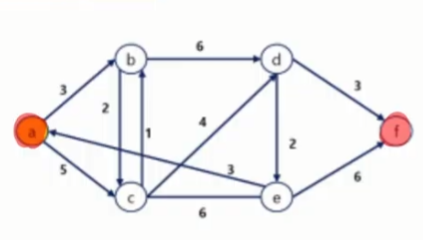

# 최단 경로
<details>
<summary>목차</summary>

1. 최단 경로
  - 다익스트라 알고리즘
  - 벨만포드 알고리즘
  - 플로이드 - 워셜 알고리즘
</details>

## 1. 최단 경로
### 1) 최단 경로
#### 최단 경로
- 최단 경로 정의
  - 간선의 가중치가 있는 그래프에서 두 정점 사이의 경로들 중에 간선의 가중치의 합이 최소인 경로
- 하나의 시작 정점에서 끝 정점까지의 최단 경로
  - 다익스트라(dijkstra) 알고리즘 : 음의 가중치를 허용하지 않음
  - 벨만 - 포드(Bellman-Ford) 알고리즘 : 음의 가중치를 허용함

- 모든 정점들에 대한 최단 경로
  - 플로이드 - 워샬(Floyd - Warshall) 알고리즘

### 2) 다익스트라 알고리즘
#### 다익스트라 알고리즘
- Dijkstra Algorithm
- 시작 정점에서 다른 모든 정점으로의 최단 경로를 구하는 알고리즘
- 시작 정점에서의 다른 모든 정점으로의 최단 경로를 구하는 알고리즘
- 시작 정점에서의 거리가 최소인 정점을 선택해 나가면서 최단 경로를 구하는 방식
- **탐욕 기법**을 사용한 알고리즘으로 MST의 프림 알고리즘과 유사하다.
- **우선순위 큐**를 활용한다.

  

#### 다익스트라 알고리즘 동작 순서
- 현재 상황에서 가장 좋은 선택을 반복해서 최종 해답을 구하는 방식
  1. 시작 정점에서 각 정점까지의 최단 거리를 저장할 리스트 생성
    - 모든 거리를 무한대로 초기화하고, 시작 정점의 거리는 0으로 설정
  2. 시작 정점과 거리를 우선순위 큐에 삽입
  3. 가장 짧은 거리를 가진 정점을 추출하고, 추출한 정점과 인접한 정점을 모두 확인
    - 기존 거리보다 멀면 무시
  4. 인접한 정점과의 거리가 기존에 저장된 거리보다 작으면, 거리를 갱신하고 우선순위 큐에 삽입
  5. 우선순위 큐가 모두 빌 때까지 **3~4 과정** 반복

### 3) 벨만-포드 알고리즘
#### 벨만-포드 알고리즘
- Bellman-Ford Algorithm
- 시작 정점에서 다른 모든 정점으로의 최단 경로를 구하는 알고리즘
- **음수 가중치**를 갖는 간선이 있는 그래프에서도 동작
- 다익스트라 알고리즘과 달리, 탐욕 기법 대신 **동적 프로그래밍(DP) 접근**을 사용한다.
- 우선순위 큐를 사용하지 않는다.

#### 벨만-포드 알고리즘 동작 순서
1. 시작 정점에서 각 정점까지의 최단 거리를 저장할 리스트 생성
  - 모든 거리를 무한대로 초기화하고, 시작 정점의 거리는 0으로 설정
2. 모든 간선을 반복해서 검사하고, 각 간선을 통해 더 짧은 경로가 발견되면 거리를 업데이트
  - **1번째 반복** : 시작 정점에서 한 개의 간선만으로 갈 수 있는 모든 정점들의 최단 거리가 갱신
  - **2번째 반복** : 시작 정점에서 최대 두 개의 간선만으로 갈 수 있는 모든 정점들의 최단 거리가 갱신
  - **k번째 반복** : 시작 정점에서 최대 k개의 간선만으로 갈 수 있는 모든 정점들의 최단 거리가 갱신
3. 마지막 정점을 제외한 모든 정점에 대해서 2번 과정 반복 (v - 1번 탐색)
4. 마지막으로 한 번 더 모든 간선을 검사하여 거리가 갱신되면, 음수 사이클이 존재한다는 것을 의미

### 4) 플로이드 - 워셜 알고리즘
#### 플로이드 - 워셜 알고리즘
- Floyd - Warshall Algorithm
- 모든 정점 쌍 간의 최단 경로를 구하는 알고리즘
  - 다익스트라, 벨만포드는 정점과 정점간의 최단 경로를 구하는 알고리즘
- 동적 프로그래밍을 사용하여 최단 경로를 점진적으로 갱신
- 음수 가중치가 있어도 정상적으로 동작 (음수 사이클은 X)
- 다익스트라 알고리즘과 시간 복잡도는 동일하지만 구현이 간단하다.

#### 플로이드 - 워셜 알고리즘 동작 원리
- 동적 계획 알고리즘으로 모든 쌍 최단 경로 문제를 해결하려면 먼저 부분문제들을 찾아야 한다.
- 이를 위해 일단 그래프의 정점의 수가 적을 때를 생각해보자
- 그래프에 3개의 정점이 있는 경우, 정점 i에서 정점 j까지의 최단 경로를 찾으려면 2가지 경로, 즉, 정점 i에서 정점 j로 직접 가는 경로와 정점 1을 경유하는 경로 중에서 짧은 것을 선택하면 된다.
  ```python
  '''
                  1
                ↗  \
              /     \
            /        ↘
          i ---------→ j
  '''
  ```
- 또 하나의 중요한 아이디어는 경유 가능한 정점들을 정점 1로부터 시작하여, 정점 1과 2, 그 다음엔 정점 1,2,3으로 하나씩 추가하여, 마지막에는 1~n까지의 모든 정점을 경유 가능한 정점들로 고려하면서, 모든 쌍의 최단 경로의 거리를 계산한다. (DP)
- 부분문제 정의 : 단, 입력 그래프의 정점을 각각 1, 2, 3, ..., n이라 하자.
  - D_(ij)^k = 정점 {1, 2, ... k}만을 경유 가능한 정점들로 고려하여, 정점 i로부터 정점 j까지의 모든 경로 중에서 가장 짧은 경로의 거리

- 여기서 k ≠ i, k ≠ j이고, k=0인 경우, 정점 0은 그래프에 없으므로 어떤 정점도 경유하지 않는다는 것을 의미, 따라서 D_(ij)^0은 입력으로 주어지는 간선 (i, j)의 가중치이다.
- D_(ij)^1은 i에서 정점 1을 경유하여 j로 가는 경로와 i에서 j로 직접 가는 경로 중에서 짧은 거리이다.
- 따라서 모든 쌍 i와 j에 대하여 D_(ij)^1을 계산하는 것이 가장 작은 부분 문제들이다. 단, i ≠ 1, j ≠ 1
- 그 다음엔 i에서 정점 2를 경유하여 j로 가는 경로의 거리와 D_(ij)^1 중에서 짧은 거리를 D_(ij)^2로 정한다.
- 단, 정점 2를 경유하는 경로의 거리는 D_(i2)^1 + D_(2j)^1
- 모든 쌍 i와 j에 대하여 D_(ij)^2를 계싼하는 것이 그 다음으로 큰 부분 문제들이다. 단, i ≠ 2, j ≠ 2
- k를 계속 늘려 정점 i에서 정점 k를 경유하여 j로 가는 경로의 거리와 D_(ij)^(k-1) 중에서 짧은 거리를 D_(ij)^k로 정한다.
- 단, 정점 k를 경유하는 경로의 거리는 D_(ik)^(k-1) + D_(kj)^(k-1)이고, i ≠ k, j ≠ k
- 이런 방식으로 k가 1에서 n이 될 때까지 D_(ij)^k를 계산하여, D_(ij)^n 즉, 모든 정점을 경유 가능한 정점들로 고려한 모든 쌍 i와 j의 최단 경로의 거리를 찾는 방식이 플로이드-워셜의 모든 쌍 최단 경로 알고리즘