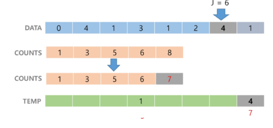
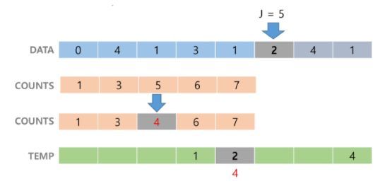
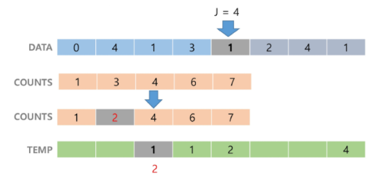
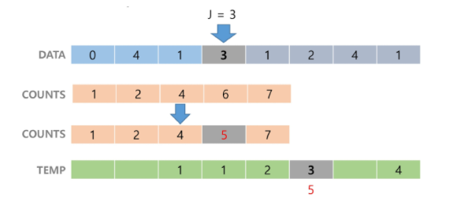
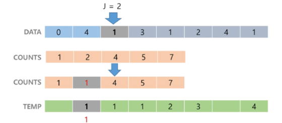
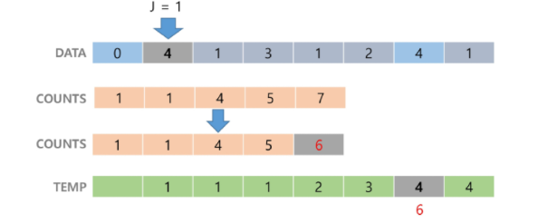
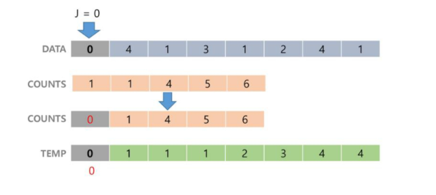
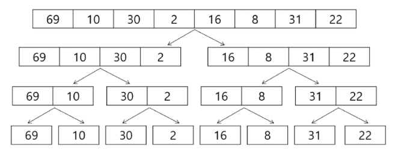
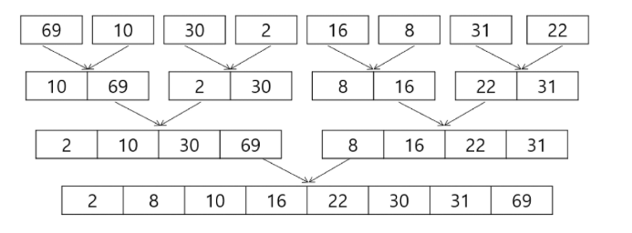

# 정렬
<details>
<summary>목차</summary>

1. 정렬
- 버블정렬
- 삽입정렬
- 카운팅정렬
- 선택정렬
- 병합정렬
- 퀵 정렬

</details>

## 1. 정렬
### 1) 버블 정렬
#### 버블 정렬(Bubble Sort)
- 인접한 두 개의 원소를 비교하며 자리를 계속 교환하는 방식
- 정렬 과정
  1. 첫 번째 원소부터 인접한 원소끼리 계속 자리를 교환하면서 맨 마지막 자리까지 이동한다.
  2. 한 단계가 끝나면 가장 큰 원소가 마지막 자리로 정렬된다.
  3. 교환하며 자리를 이동하는 모습이 물 위에 올라오는 거품 모양과 같다고 하여 버블 정렬이라고 한다.
- 시간복잡도 : O(n^2)

#### 버블 정렬 과정
- [55, 7, 78, 12, 42]를 오름차순 정렬하는 과정
- 첫 번째 패스
  - 55 7 78 12 42
  - 7 55 78 12 42
  - 7 55 78 12 42
  - 7 55 12 78 42
  - 7 55 12 42 78
  -            정렬된 원소

- 두 번째 패스
  - 7 55 12 42 78
  - 7 55 12 42 78
  - 7 12 55 42 78
  - 7 12 42 55 78

- 세 번째 패스
  - 7 12 42 55 78
  - 7 12 42 55 78
  - 7 12 42 55 78

- 네 번째 패스
  - 7 12 42 55 78

- 정렬 끝

#### 버블정렬 알고리즘
```python
def bubble_sort(arr):
  n = len(arr)

  for i in range(n):
    for j in range(0, n - i - 1):
      if arr[j] > arr[j + 1]:
        arr[j], arr[j + 1] = arr[j + 1], arr[j]
```

### 2) 삽입 정렬
#### 삽입 정렬(Insertion Sort)
- 리스트를 정렬/미정렬로 나누고, '미정렬' 부분의 원소를 '정렬된' 부분의 올바른 위치에 삽입
- 정렬과정
  1. 정렬한 자료를 두 개의 부분집합 S와 U로 가정
    - 부분집합 S : 정렬된 앞부분의 원소들
    - 부분집합 U : 아직 정렬되지 않은 나머지 원소들
  2. 정렬되지 않은 부분집합 U의 원소를 하나씩 꺼내서 이미 정렬되어있는 부분집합 S의 마지막 원소부터 비교하면서 위치를 찾아 삽입한다.
  3. 삽입 정렬을 반복하면서 부분집합 S의 원소는 하나씩 늘리고 부분집합 U의 원소는 하나씩 감소하게 된다. 부분집합 U가 공집합이 되면 삽입정렬이 완성된다.

- 시간복잡도 : O(n^2)

#### 삽입 정렬 과정
- [69, 10, 30, 2, 16, 8, 31, 22]를 삽입 정렬하는 과정
  1. 초기상태 : 첫 번째 원소는 정렬된 부분 집합 S로 생각하고 나머지 원소들은 정렬되지 않은 부분 집합 U로 생각한다.
      - 69 10 30 2 16 8 31 22
  2. U의 첫번째 원소 10을 S의 마지막 원소 69와 비교할 때, 10 < 69이므로, 원소 10은 69의 앞자리에 위치하게 된다.
    - 더 이상 비교할 S의 원소가 없으므로 찾은 위치에 원소 10을 삽입한다.
      - 69 10 30 2 16 8 31 22
      - 10 69 30 2 16 8 31 22
  3. U의 첫 번째 원소 30을 S의 마지막 원소 69와 비교할 때, 30 < 69이므로, 69의 앞자리 원소 10과 비교한다.
    - 30 > 10이므로 원소 10과 69 사이에 삽입한다.
      - 10 69 30 2 16 8 31 22
      - 10 30 69 2 16 8 31 22
  4. U의 첫 번째 원소 2를 S의 마지막 원소 69와 비교할 때, 2 < 69이므로, 69의 앞자리 원소 30과 비교한다.
    - 비교를 반복하여 최종적으로 가장 앞자리에 삽입한다.
      - 10 30 69 2 16 8 31 22
      - 2 10 30 69 16 8 31 22
  5. U의 첫 번째 원소 16을 S의 마지막 원소 69와 비교할 때, 16 < 69이므로, 69의 앞자리 원소 30과 비교한다.
    - 비교를 반복하여 10과 30 사이에 삽입한다.
      - 2 10 30 69 16 8 31 22
      - 2 10 16 30 69 8 31 22
  6. U의 첫 번째 원소 8을 S의 마지막 원소 69와 비교할 때, 8 < 69이므로, 69의 앞자리 원소 30과 비교한다.
    - 비교를 반복하여 2와 10 사이에 삽입한다.
      - 2 10 16 30 69 8 31 22
      - 2 8 10 16 30 69 31 22
  7. U의 첫 번째 원소 31을 S의 마지막 원소 69와 비교할 때, 31 < 69이므로, 69의 앞자리 원소 30과 비교한다.
    - 비교를 반복하여 30와 69 사이에 삽입한다.
      - 2 8 10 16 30 69 31 22
      - 2 8 10 16 30 31 69 22
  8. U의 첫 번째 원소 22을 S의 마지막 원소 69와 비교할 때, 22 < 69이므로, 69의 앞자리 원소 30과 비교한다.
    - 비교를 반복하여 16와 30 사이에 삽입한다.
      - 2 8 10 16 30 31 69 22
      - 2 8 10 16 22 30 31 69
  
#### 삽입 정렬 알고리즘
  ```python
  def insertion_sort(arr):
    n = len(arr) # 배열의 길이
    
    for i in range(1, n):
      for j in range(i, 0, -1):
        if arr[j-1] > arr[j]:
          arr[j-1], arr[j] = arr[j], arr[j-1]
        else:
          break
  ```

### 3) 카운팅 정렬
#### 카운팅 정렬(Counting Sort)
- 항목들의 순서를 결정하기 위해 집합에 각 항목이 몇 개씩 있는지 세는 작업을 하여, 선형 시간에 정렬하는 효율적인 알고리즘
- 제한사항
  - 정수나 정수로 표현할 수 있는 자료에 대해서만 적용 가능
    - 각 항목의 바생 횟수를 기록하기 위해, 정수 항목으로 인덱스 되는 카운트들의 배열을 사용하기 때문이다.
  - 카운트들을 위한 충분한 공간을 할당하려면 집합 내의 가장 큰 정수를 알아야 한다.
- 시간 복잡도
  - O(n+k) : n은 리스트 길이, k는 정수의 최대값

#### 카운팅 정렬 과정
- {0, 4, 1, 3, 1, 2, 4, 1}을 카운팅 정렬하는 과정
1. Data에서 각 항목들의 발생 횟수를 세고, 정수 항목들로 직접 인덱스 되는 카운트 배열 counts에 저장한다.
  - Data    0 4 1 3 1 2 4 1
  - Counts  0 0 0 0 0
  - Counts  1 3 1 1 2

2. 정렬된 집합에서 각 항목의 앞에 위치할 항목의 개수를 반영하기 위해 counts의 원소를 조정한다.
  - Data    0 4 1 3 1 2 4 1
  - Counts  1 3 1 1 2
  - Counts  1 4 5 6 8

3. counts[1]을 감소시키고 Temps[3]에 1을 저장한다.
  

4. counts[4]을 감소시키고 Temps[7]에 4를 저장한다.
  

5. counts[2]을 감소시키고 Temps[4]에 2를 저장한다.
  

6. counts[1]을 감소시키고 Temps[2]에 1를 저장한다.
  

7. counts[3]을 감소시키고 Temps[5]에 3를 저장한다.
  

8. counts[1]을 감소시키고 Temps[1]에 1를 저장한다.
  

9. counts[4]을 감소시키고 Temps[6]에 4를 저장한다.
  

10. counts[0]을 감소시키고 Temps[0]에 0를 저장한다. [정렬 완료]
  

#### 카운팅 정렬 코드
```python
def counting_sort(arr, max_value):
  n = len(arr)
  count_arr = [0] * (max_value + 1)
  result = [0] * n

  for num in arr:
    count_arr[num] += 1

  for i in range(1, k + 1):
    count_arr[i] += count_arr[i - 1]
  
  for i in range(n - 1, -1, -1):
    val = arr[i]
    result[count_arr[val] - 1] = val
    count_arr[val] -= 1
  
  return result
```

### 4) 선택 정렬
#### 선택 정렬
- Selection Sort
- 포켓볼 순서대로 정렬하기
  - 왼쪽과 같이 흩어진 당구공을 오른쪽 그림처럼 정리한다고 하자. 어떻게 하겠는가?
  - 많은 사람들 당구대 위에 있는 공 중 가장 작은 숫자의 공부터 골라서 차례대로 정리할 것이다. 이것이 바로 선택정렬이다.
- 주어진 자료들 중 가장 작은 값의 원소부터 차례대로 선택하여 위치를 교환하는 방식
- 정렬 과정
  - 주어진 리스트 중에서 최소값을 찾는다.
  - 그 값을 리스트의 맨 앞에 위치한 값과 교환한다.
  - 맨 처음 위치를 제외한 나머지 리스트를 대상으로 위의 과정을 반복한다.
- 시간복잡도 : O(n^2)

#### 선택 정렬 과정
1. 주어진 리스트에서 최소값을 찾는다.
2. 리스트의 맨 앞에 위치한 값과 교환한다.
  - 64 25 10 22 11
  - 10 25 64 22 11
3. 주어진 리스트에서 최소값을 찾는다.
4. 리스트의 맨 앞에 위치한 값과 교환한다.
  - 10 25 64 22 11
  - 10 11 64 22 25
5. 미정렬 리스트에서 최소값을 찾는다.
6. 리스트의 맨 앞에 위치한 값과 교환한다.
  - 10 11 64 22 25
  - 10 11 22 64 25
7. 미정렬 리스트에서 최소값을 찾는다.
8. 리스트의 맨 앞에 위치한 값과 교환한다.
9. 정렬 완료
  - 10 11 22 64 25
  - 10 11 22 25 64

#### 선택 정렬 알고리즘
```python
def selection_sort(arr):
  n = len(arr)
  
  for i in range(n - 1):
    min_idx = i

    for j in range(i + 1, n):
      if arr[j] < arr[min_idx]:
        min_idx = j
      
      arr[i], arr[min_idx] = arr[min_idx], arr[i]
```

### 5) 병합 정렬
#### 병합 정렬
- Merge Sort
- 여러 개의 정렬된 자료의 집합을 병합하여 한 개의 정렬된 집합으로 만드는 방식
- 분할 정복 알고리즘 활용
  - 자료를 최소 단위의 문제까지 나눈 후에 차례대로 정렬하여 최종 결과를 얻어냄
  - top-down 방식
- 시간복잡도 : O(nlogn)

#### 병합 정렬 과정
- {69, 10, 30, 2, 16, 8, 31, 22}를 병합 정렬하는 과정
- 분할 단계 : 전체 자료 집합에 대하여, 최소 크기의 부분집합이 될 때까지 분할 작업을 계속한다.
  

- 병합 단계 : 2개의 부분집합을 정렬하면서 하나의 집합으로 병합
- 8개의 부분집합이 1개로 병합될 때까지 반복함
  

#### 병합 정렬 알고리즘
```python
def merge_sort(arr):
  n = len(arr)

  if n <= 1:
    return arr
  
  mid = n // 2
  left_half = arr[:mid]
  right_half = arr[mid:]

  left_half = merge_sort(left_half)
  right_half = merge_sort(right_half)

  return merge(left_half, right_half)

def merge(left, right):
  result = []

  while left and right:
    if left[0] < right[0]:
      result.append(left.pop(0))
    else:
      result.append(right.pop(0))
  
  result.extend(left)
  result.extend(right)

  return result
```

### 6) 퀵 정렬
#### 퀵 정렬
- Quick Sort
- 주어진 배열을 두 개로 분할하고, 각각을 정렬한다.
- 퀵 정렬은 분할할 떄, 기준 아이템(pivot item)을 중심으로, 이보다 작은 것은 왼편, 같거나 큰 것은 오른편에 위치한다.
- 시간복잡도 : O(nlogn)

#### 퀵 정렬 아이디어
1. P(피벗) 값들보다 같거나 큰 값은 오른쪽, 작은 값들은 왼쪽 집합에 위치하도록 한다.
2. 피벗을 두 집합의 가운데에 위치시킨다.

#### 퀵 정렬 알고리즘
```python
def quick_sort(arr, start, end):
  if start < end:
    p = partition(arr, start, end)

    quick_sort(arr, start, p - 1)
    quick_sort(arr, p + 1, end)
  
def partition(arr, start, end):
  p = arr[start]
  left = start + 1
  right = end

  while True:
    while left <= end and arr[left] < p:
      left += 1
    while right > start and arr[right] >= p:
      right -= 1
    if left < right:
      arr[left], arr[right] = arr[right], arr[left]
    else:
      break
    
  arr[start], arr[right] = arr[right], arr[start]
  return right
```
    