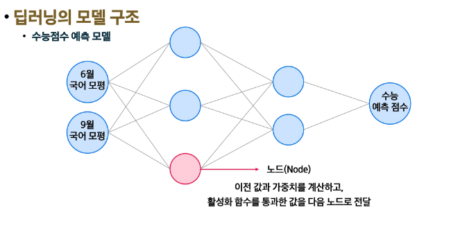
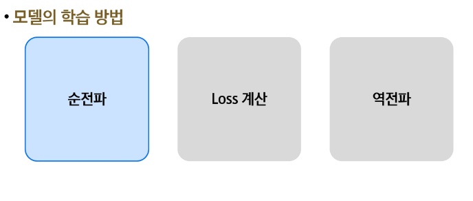

# 스택과 큐

목차

1. 스택
  - 스택의 구조와 작동원리
  - 스택 응용

2. 큐
  - 큐의 구조와 작동원리
  - 큐 응용

3. 원형 큐
  - 원형 큐의 구조와 작동원리

4. 연결 리스트
  - 연결 리스트 개요
  - 단순 연결리스트

5. 참고
  - 이중 연결 리스트

## 스택
### 스택의 구조와 작동원리
#### 스택(stack)
- 물건을 쌓아 올리듯 자료를 쌓아 올린 형태의 자료구조
- 스택에 저장된 선형 구조를 갖음
  - 선형구조 : 데이터 요소를 사이에 순서가 존재
  - 비선형구조 : 데이터 요소가 순차적으로 나열되지 않음
- 스택에 자료를 삽입하거나 스택에서 자료를 꺼낼 수 있음
- **후입선출** 구조(LIFO, Last-In-First-Out)
  - 마지막에 삽입한 자료를 가장 먼저 꺼냄
  - 예 : 스택에 1, 2, 3 순으로 자료를 삽입하면 꺼낼 땐 3, 2, 1 순으로 꺼낼 수 있음

#### 스택 주요 연산
- Push
  - 저장소에 자료를 저장 (삽입)

- Pop
  - 저장소에서 자료를 꺼냄 (삭제)
  - 꺼낸 자료는 삽입한 자료의 역순으로 꺼냄

- IsEmpty
  - 스택이 공백인지 확인

- Peek
  - 스택의 top에 있는 자료를 반환

#### 스택의 삽입 / 삭제 과정
- 빈 스택에 원소 A, B, C를 차례로 삽입 후 한 번 삭제하는 연산과정

### 스택 응용
#### 스택 응용1 : 괄호 검사
- 괄호의 종류 : 대괄호 [], 중괄호 {}, 소괄호 ()
- 조건
  1. 왼쪽 괄호의 개수와 오른쪽 괄호의 개수가 같아야 함
  2. 같은 괄호에서 왼쪽 괄호는 오른쪽 괄호보다 먼저 나와야 함
  3. 괄호는 서로 짝이 맞아야 함
- 잘못된 괄호 사용의 예
  -  (a(b) 
  -  a(b)c) 
  -  a{b(c[d]e}f) 
- 문자열에 있는 괄호는 차례대로 조사하면서 왼쪽 괄호를 만나면 스택에 삽입하고, 오른쪽 괄호를 만나면 스택에서 top 괄호를 삭제한 후 오른쪽 괄호와 짝이 맞는지 검사
- 이 때, 스택이 비어 있으면 조건1 또는 조건2에 위배되고 괄호의 짝이 맞지 않으면 조건3에 위배됨
- 마지막 괄호까지를 조사한 후에도 스택에 괄호가 남아 있으면 조건1에 위배됨

#### 스택 응용2: Fuction call
- 프로그램에서의 함수 호출과 복귀에 따른 수행 순서를 관리
  - 가장 마지막에 호출된 함수가 가장 먼저 실행을 완료하고 복귀하는 후입선출 구조이므로, 후입선출 구조의 스택을 이용하여 수행순서를 관리
- 함수 호출이 발생하면 호출한 함수 수행에 필요한 지역변수, 매개변수 및 수행 후 복귀할 주소 등의 정보를 스택 프레임(stack frame)에 저장하여 시스템 스택에 삽입
- 함수의 실행이 끝나면 시스템 스택의 top 원소(스택 프레임)를 삭제(pop)하면서 프레임에 저장되어 있던 복귀 주소를 확인하고 복귀
- 함수 호출과 복귀에 따라 이 과정을 반복하여 전체 프로그램 수행이 종료되면 시스템 스택은 공백 스택이 됨.

#### 스택 응용3: 계산기
- 문자열로 된 계산식이 주어질 때, 스택을 이용하여 이 계산식의 값을 계산할 수 있다.
- 문자열 수식 계산의 일반적 방법
  - step 1. 중위 표기법의 수식을 후위 표기법으로 변경(스택 이용)
  - step 2. 후위 표기법의 수식을 스택을 이용하여 계산함
- 표기법
  - 중위 표기법 : 연산자를 피연산자의 가운데 표시하는 방법 (A+B)
  - 후위 표기법 : 연산자를 피연산자 뒤에 표기하는 방법 (AB+)

## 큐
### 큐의 구조와 작동원리
#### 큐(queue)
- 스택과 마찬가지로 삽입과 삭제의 위치가 제한적인 자료구조
  - 큐의 뒤에서는 삽입만 하고, 큐의 앞에서는 삭제만 이루어지는 구조
- **선입선출** 구조 (FIFO, First In First Out)
  - 큐에 삽입한 순서대로 원소가 저장되어, 가장 먼저 삽입한(First In)된 원소는 가장 먼저 삭제(First Out)됨

#### 큐의 주요 연산
- EnQueue
  - 큐의 뒤쪽에 원소를 삽입하는 연산
- Dequeue
  - 큐의 앞쪽에서 원소를 삭제하고 반환하는 연산
- IsEmpty
  - 큐가 공백상태인지를 확인하는 연산
- Peek
  - 큐의 앞쪽에서 원소를 삭제없이 반환하는 연산

#### 큐의 연산 과정
1) 공백 큐 생성

2) 원소 A 삽입: enQueue(A);

3) 원소 B 삽입: enQueue(B);

4) 원소 반환 / 삭제 : deQueue();

5) 원소 C 삽입 : enQueue(C);

6) 원소 반환 / 삭제 : deQueue();

7) 원소 반환 / 삭제 : deQueue();

### 큐 응용
#### 큐 응용: 버퍼
- 데이터를 한 곳에서 다른 한 곳으로 전송하는 동안 일시적으로 그 데이터를 보관하는 메모리의 영역
- 버퍼는 일반적으로 입출력 및 네트워크와 관련된 기능에서 이용
- 순서대로 입력 / 출력 / 전달되어야 하므로 FIFO 방식의 자료구조인 큐가 활용

## 원형 큐
### 원형 큐의 구조와 작동원리
#### 원형 큐(Circular Queue)
- 잘못된 포화상태 인식
  - 선형 큐를 이용하여 원소의 삽입과 삭제를 계속할 경우, 리스트의 앞부분에 활용할 수 있는 공간이 있음에도 불구하고, rear=n-1인 상태 즉, 표화상태로 인식하여 더 이상의 삽입을 수행하지 않게 됨

  

- 해결방법 1
  - 매 연산이 이루어질 때마다 저장된 원소들을 배열의 앞부분으로 모두 이동시킴
  - 원소 이동에 많은 시간이 소요되어 큐의 효율성이 급격히 떨어짐

  

- 해결방법 2
  - 1차원 배열을 사용하되, 논리적으로는 배열의 처음과 끝이 연결되어 원형 형태의 큐를 이룬다고 가정하고 사용
  - 원형 큐의 논리적 구조

## 연결 리스트
### 연결 리스트 개요
#### 리스트의 문제점
- 자료의 삽입/삭제 연산 과정에서 연속적인 메모리 배열을 위해 원소들을 이동시키는 작업이 필요
- 원소의 개수가 많고 삽입/삭제 연산이 빈번하게 일어날수록 작업에 소요되는 시간이 크게 증가
  

#### 연결 리스트(Linked List)
- 자료의 논리적인 순서와 메모리 상의 물리적인 순서가 일치하지 않고, 개별적으로 위치하고 있는 **각 원소를 연결**하여 **하나의 전체적인 자료구조**를 이룸
- **링크를 통해 원소에 접근**하므로, 리스트에서처럼 물리적인 순서를 맞추기 위한 작업이 필요X
- 자료구조의 크기를 동적으로 조정할 수 있어, **메모리의 효율**적인 사용이 가능

#### 연결 리스트의 기본 구조
- 노드
  - 연결 리시트에서 하나의 원소를 표현하는 기본 구성 요소
  - 구성 요소
    1. 데이터 필드
      - 원소의 값을 저장
      - 저장할 원소의 종류나 크기에 따라 구조를 정의하여 사용함
    2. 링크 필드
      - 다음 노드의 참조 값을 저장
- 헤드
  - 연결 리스트의 첫 노드에 대한 참조 값을 갖고 있음

### 단순 연결 리스트
