# State Management

<details>
<summary>Index</summary>

1. State Management

2. State management library(Pinia)
  - Pinia
  - Pinia 구조
  - Pinia 구성 요소 활용
  - Local Storage

3. Routing

4. Vue Router
  - Basic Routing
  - Named Routes
  - Dynamic Route Matching
  - Nested Routes
  - Programmatic Navigation
</details>

## 1. State Management
### 1) 개요
#### State Management [상태 관리]
- Vue 컴포넌트는 이미 반응형 상태를 관리하고 있음
- > 상태 === 데이터

#### 컴포넌트 구조의 단순화
- 상태(State)
  - 앱 구동에 필요한 기본 데이터
  
- 뷰(View)
  - 상태를 선언적으로 매핑하여 시각화

- 기능(Actions)
  - 뷰에서 사용자 입력에 대해 반응적으로 상태를 변경할 수 있게 정의된 동작

```vue
<template>
    <!-- 뷰(View) -->
     <div>{{ count }}</div>
</template>

<script setup>
import { ref } from 'vue'

// 상태 (State)
const count ref(0)

// 기능 (Actions)
const increment = function () {
    count.value++
}
</script>
```
- > '단뱡향 데이터 흐름'의 간단한 표현

#### 상태 관리의 단순성이 무너지는 시점
- "여러 컴포넌트가 상태를 공유할 때"
  1. 여러 뷰가 동일한 상태에 종속되는 경우
     - 공유 상태를 공통 조상 컴포넌트로 "끌어올린" 다음 props로 전달하는 것
     - 하지만 계층 구조가 깊어질 경우 비효율적, 관리가 어려워짐

    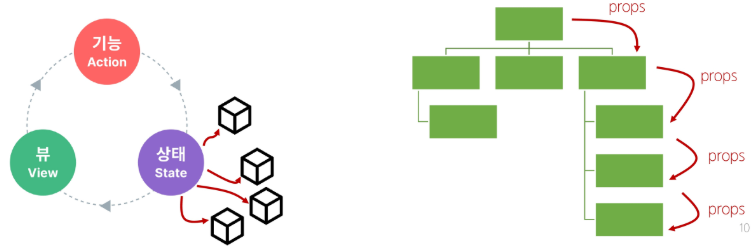

  2. 서로 다른 뷰의 기능이 동일한 상태를 변경시켜야 하는 경우
     - 발신(emit)된 이벤트를 통해 상태의 여러 복사본을 변경 및 동기화하는 것
     - 마찬가지로 관리의 패턴이 깨지기 쉽고 유지 관리할 수 없는 코드가 됨

    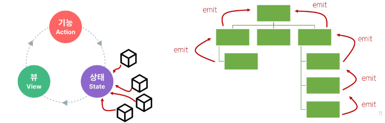

#### 해결책
- 각 컴포넌트의 공유 상태를 추출하여, 전역에서 참조할 수 있는 저장소에서 관리
  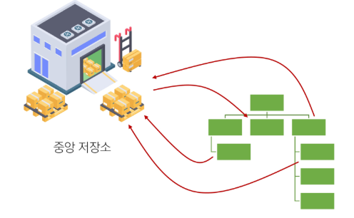

  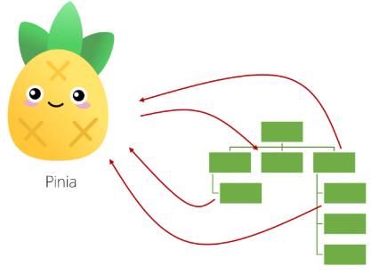

- 컴포넌트 트리는 하나의 큰 View가 되고 모든 컴포넌트는 트리 계층 구조에 관계 없이 상태에 접근하거나 기능을 사용할 수 있음
- > Vue의 공식 상태 관리 라이브러리 === <span style='color:red'>"Pinia"</span>

## 2. State management library (Pinia)
### 1) Pinia
#### Pinia
- Vue 공식 상태 관리 라이브러리

#### Pinia 설치
- Vite 프로젝트 빌드 시 Pinia 라이브러리 추가

#### Vue 프로젝트 구조 변화
- stores 폴더 신규 생성

### 2) Pinia 구조
#### Pinia 구성 요소
1. store
2. state
3. getters
4. actions
5. plugin

#### 1. Pinia 구성 요소 - 'store'
- 중앙 저장소
- 모든 컴포넌트가 공유하는 상태, 기능 등이 작성됨
- > `defineStore()`의 반환 값의 이름은 use와 store를 사용하는 것을 권장
- > `defineStore()`의 첫번쨰 인자는 애플리케이션 전체에 설쳐 사용하는 store의 고유 ID
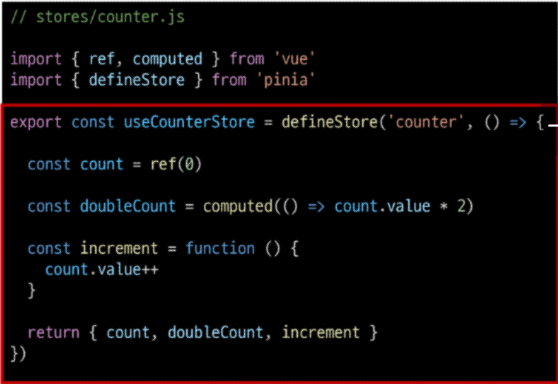

#### 2. Pinia 구성 요소 - 'state'
- 반응형 상태(데이터)
- `ref() === state`
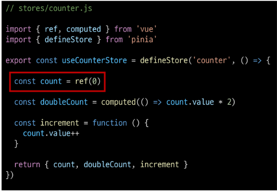

#### 3. Pinia 구성 요소 - 'getters'
- 계산된 값
- `computed() === getters`
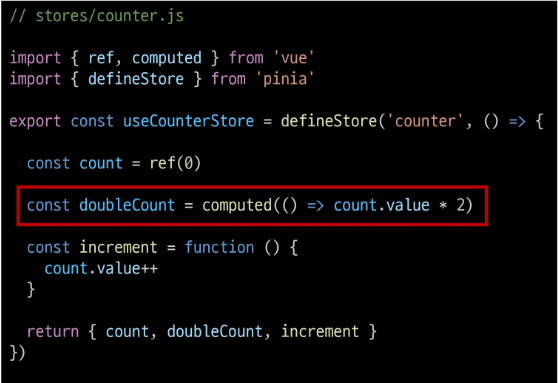

#### 4. Pinia 구성 요소 - 'actions'
- 메서드
- `function() === actions`
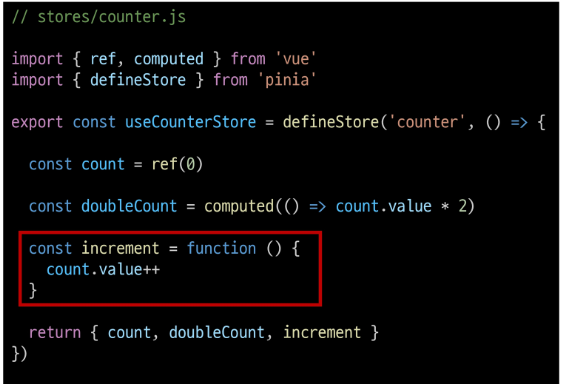

#### Setup Stores의 반환 값
- pinia의 상태들을 사용하려면 반드시 반환해야 함
- <span style='color:red'>store에서는 공유하지 않는 private한 상태 속성을 가지지 않음</span>
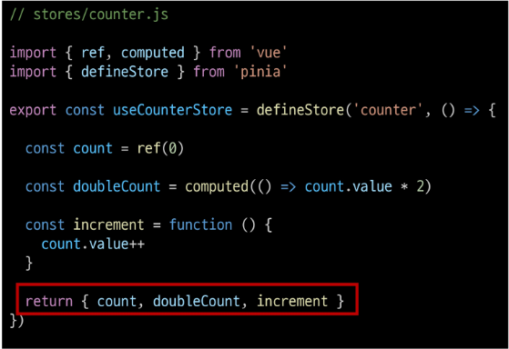

#### 5. Pinia 구성 요소 - 'plugin'
- 애플리케이션의 상태 관리에 필요한 추가 기능을 제공하거나 확장하는 도구나 모듈
- 애플리케이션의 상태 관리를 더욱 간편하고 유연하게 만들어주며 패키지 매니저로 설치 이후 별도 설정을 통해 추가됨

#### Pinia 구성 요소 정리
- Pinia는 **store**라는 저장소를 가짐
- **store**는 **state, getters, actions**으로 이루어지며, 각각 **ref(), computed(), function()**과 동일함
  
### 3) Pinia 구성 요소 활용
#### State
- 각 컴포넌트 깊이에 관계 없이 store 인스턴스로 state에 접근하여 직접 읽고 쓸 수 있음
- 만약 store에 state를 정의하지 않았다면 컴포넌트에서 새로 추가할 수 없음
    ```vue
    <!-- App.vue -->

    <template>
        <div>
            <p> state : {{ store.count }}</p>
        </div>
    </template>

    <script>
    import { useCounterStore } from '@/stores/counter'

    const store = useCounterStore()

    // state 참조 및 변경
    console.log(store.count)
    const newNumber = s tore.count + 1
    </script>
    ```

#### Getters
- store의 모든 getters 또한 state처럼 직접 접근할 수 있음
  ```vue
  <template>
    <div>
        <p>getters : {{ store.doubleCount }}</p>
    </div>
  </template>

  <script>
  // getters 참조
  console.log(store.doubleCount)
  </script>
  ```

#### Actions
- store의 모든 actions 또한 직접 저근 및 호출할 수 있음
- gettes와 달리 state 조작, 비동기, API 호출이나 다른 로직을 진행할 수 있음
  ```vue
  <template>
    <div>
        <button @click='store.increment()'>+++</button>
    </div>
  </template>

  <script>
  // actions 호출
  store.increment()
  </script>
  ```

#### Vue devtools로 Pinia 구성 요소 확인하기

### 4) Local Storage
#### Local Storage
- 브라우저 내에 key-value 쌍을 저장하는 웹 스토리지 객체

#### Local Storage 특징
- 페이지를 새로 고침하고 브라우저를 다시 실행해도 데이터가 유지
- 쿠키와 다르게 네트워크 요청 시 서버로 전송되지 않음
- 여러 탭이나 창 간에 데이터를 공유할 수 있음

#### Local Storage 사용 목적
- 웹 애플리케이션에서 사용자 설정, 상태 정보, 캐시 데이터 등을 클라이언트 측에서 보관하여 웹사이트의 성능을 향상시키고 사용자 경험을 개선하기 위함

#### pinia-plugin-persistedstate
- Pinia의 플러그인(plugin) 중 하나
- 웹 애플리케이션의 상태(state)를 브라우저의 local storage나 session storage에 영구적으로 저장하고 복원하는 기능을 제공

#### pinia-plugin-persistedstate 설정
- 설치 및 등록
  - `$ npm i pinia-plugin-persistedstate`
  ```js
  // main.js

  import piniaPluginPersistedstate from 'pinia-plugin-persistedstate'

  const app = createApp(App)
  const pinia = createPinia()

  pinia.use(piniaPluginPersistedstate)

  //app.use(createPinia())
  app.use(pinia)

  app.mount('#app')
  ```

  - `defineStore()`의 3ㅓㅂㄴ째 인자로 관련 객체 추가
    ```js
    // stores/counter.js

    export const useCounterStore = defineStore('counter', () => {
        ...,
        return { count, doubleCOunt, increment }
    }, { presist : true }
    )
    ```

  - 적용 결과 (개발자도구 -> Application -> Local Storage)
    - 브라우저의 Local Storage에 저장되는 todos state 확인

## 참고
#### 이제 모든 데이터를 store에서 관리해야 할까?
- Pinia를 사용한다고 해서 모든 데이터를 state에 넣어야 하는 것은 아님
- pass props, emit event를 함께 사용하여 애플리케이션을 구성해야 함
- 상황에 따라 적절하게 사용하는 것이 필요

#### Pinia, 언제 사용해야 할까?
- Pinia는 공유된 상태를 관리하는 데 유용하지만, 구조적인 개념에 이해와 시작하는 비용이 큼
- 애플리케이션이 단순하다면 Pinia가 없는 것이 더 효율적일 수 있음
- 그러나 중대형 규모의 SPA를 구축하는 경우 Pinia는 자연스럽게 선택할 수 있는 단계가 오게 됨
- > 결과적으로 적절한 상황에서 활용했을 때 Pinia 효용을 극대화할 수 있음

## 3. Routing
### 1) 개요
#### Routing
- 네트워크에서 경로를 선택하는 프로세스
- > 웹 애플리케이션에서 다른 페이지 간의 전환과 경로를 관리하는 기술

#### SSR에서의 Routing
  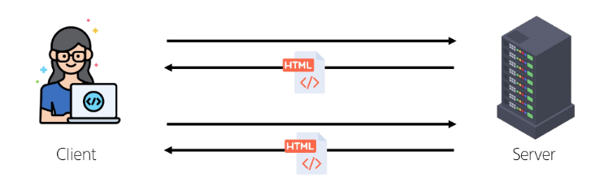
  - SSR에서 Routing은 <span style='color:red'>서버 측</span>에서 수행
  - 서버가 사용자가 방문한 URL 경로를 기반으로 응답을 전송
  - 링크를 클릭하면 브라우저는 서버로부터 HTML 응답을 수신하고 새 HTML로 전체 페이즈를 다시 로드

#### CSR에서의 Routing
  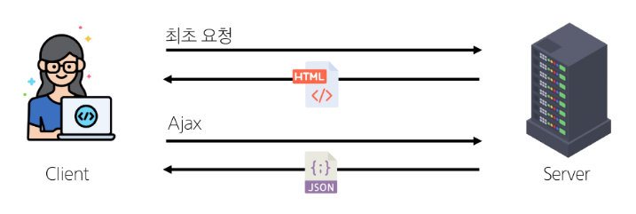
  - CSR에서 routing은 <span style='color:red'>클라이언트 측</span>에서 수행
  - 클라이언트 측 JavaScript가 새 데이터를 동적으로 가져와 전체 페이지를 다시 로드하지 않음

#### SPA에서 Routing이 없다면
- 유저가 URL을 통한 페이지의 변화를 감지할 수 없음
- 페이지가 무엇을 렌더링 중인지에 대한 상태를 알 수 없음
  - URL이 1개이기 때문에 새로고침 시 처음 페이지로 되돌아감
  - 링크를 공유할 시 첫 페이지만 공유 가능
- 브라우저의 뒤로 가기 기능을 사용할 수 없음
- > 페이지는 1개이지만, 주소에 따라 여러 컴포넌트를 새로 렌더링하여 마치 여러 페이지를 사용하는 것처럼 보이도록 해야 함

## 4. Vue Router
### 1) 개요
#### Vue Router
- Vue 공식 라우터 (The official Router for Vue.js)

#### 사전 준비
- Vite로 프로젝트 생성 시 Router 추가
- 서버 실행 후 Router로 인한 프로젝트 변화 확인
- > Home, About 링크에 따라 변경되는 URL과 새로 렌더링되는 화면

#### Vue 프로젝트 구조 변화
1. App.vue 코드 변화
2. router 폴더 신규 생성
3. views 폴더 신규 생성

#### RouterLink
- 페이지를 다시 로드하지 않고 URL을 변경하여 URL 생성 및 관련 로직을 처리
- HTML의 `<a>` 태그를 렌더링

#### RouterView
- RouterLink URL에 해당하는 컴포넌트를 표시
- 원하는 곳에 배치하여 컴포넌트를 레이아웃에 표시할 수 있음

  ```vue
  <!-- App.vue -->

  <template>
    <header>
        <nav>
            <RouterLink to='/'>Home</RouterLink>
            <ROuterLink to='/about'>About</RouterLink>
        </nav>
    </header>

    <RouterView />
  </template>
  ```

#### RouterLink와 RouterView
  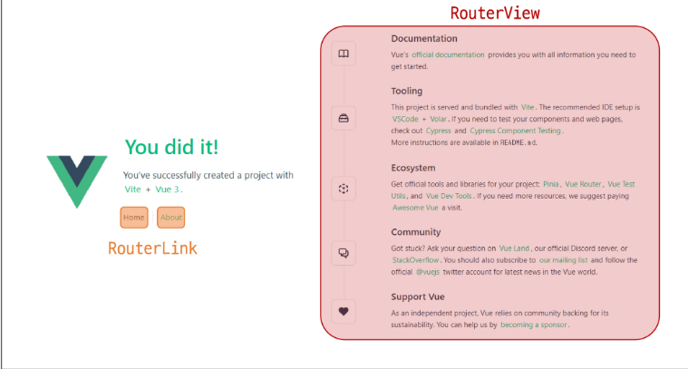

#### router/index.js
- 라우팅에 관련된 정보 및 설정이 작성되는 곳
- router에 URL과 컴포넌트를 매핑

#### views
- RouterView 위치에 렌더링할 컴포넌트를 배치
- 기존 components 폴더와 기능적으로 다른 것은 없으며 단순 분류의 의미로 구성됨
- <span style='color:red'>일반 컴포넌트와 구분하기 위해 컴포넌트 이름을 View로 끝나도록 작성하는 것을 권장</span>

### 2) Basic Routing
#### 라우팅 기본
1. index.js에 라우터 관련 설정 작성(주소, 이름, 컴포넌트)
    ```js
    <script>
    const router = createRouter({
        routes : [
            {
                path: '/',
                name: 'home',
                component: HomeView
            },
            ...
        ]
    })
    ```
2. RouterLink의 'to' 속성으로 index.js에서 정의한 주소 값(path)을 사용
    ```vue
    <!-- App.vue -->
    <template>
        <div>
            <RouterLink to='/'>Home</RouterLink>
            <RouterLink to='/about'>About</RouterLink>
        </div>
    </template>
    ```

3. RouterLink 클릭 시 경로와 일치하는 컴포넌트가 RouterView에서 렌더링 됨
    ```vue
    <!-- App.vue -->

    <RouterView />
    ```

### 3) Named Routes
#### Named Routes
- 경로에 이름을 지정하는 라우팅

#### Named Routes 예시
- name 속성 값에 경로에 대한 이름을 지정
- 경로에 연결하려면 RouterLink에 v-bind를 이용해 'to' props 객체로 전달
    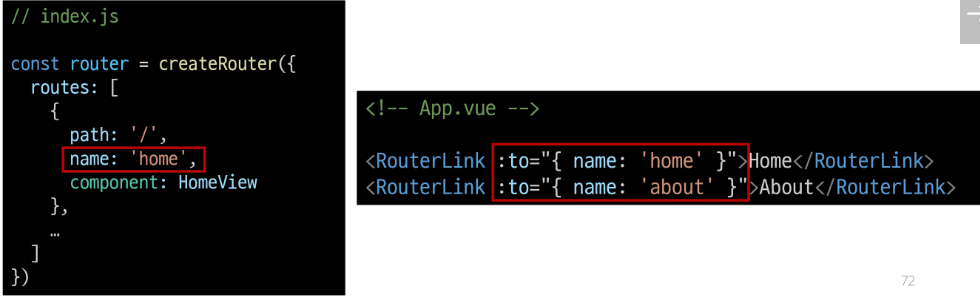

#### Named Routes 장점
- 하드 코딩된 URL을 사용하지 않아도 됨
- URL 입력 시 오타 방지

### 4) Dynamic Route Matching
#### Dynamic Route Matching
- URL의 일부를 변수로 사용하여 경로를 동적으로 매칭

#### 매개변수를 사용한 동적 경로 매칭
- 주어진 패턴 경로를 동일한 컴포넌트에 매핑해야 하는 경우 활용
- 예를 들어 모든 사용자의 ID를 활용하여 프로필 페이지 URL을 설계한다면?
  - user/1
  - user/2
  - user/3
  - > 일정한 패턴의 URL 작성을 반복해야 함

#### 매개변수를 사용한 동적 경로 매칭 활용
- views 폴더 내 UserView 컴포넌트 작성
    ```vue
    <!-- UserView.vue -->

    <template>
        <div>
            <h1>UserView</h1>
        </div>
    </template>
    ```

- 매개변수는 콜론(:)으로 표기
- > UserView 컴포넌트 라우트 등록
    ```js
    // index.js
    import UserView from '../views/UserView.vue'

    const router = createRouter({
        routes : [
            {
                path: '/user/:id',
                name: 'user',
                component: UserView
            },
        ]
    })
    ```

- 매개변수는 객체의 params 속성의 객체 타입으로 전달
- 단, 객체의 key 이름과 index.js에서 지정한 매개변수 이름이 같아야 함
- > UserView 컴포넌트로 이동하기 위한 RouterLink 작성
    ```vue
    <!-- App.vue -->
    <script>
    import { ref } from 'vue'

    const userId = ref(1)
    </script>
    <template>
        <div>
            <RouterLink :to='{name: 'user', params: {'id': userId } }'>User</RouterLink>
        </div>
    </template>
    ```

- 경로가 일치하면 라우트의 매개변수는 컴포넌트에서 `$route.params`로 참조 가능
- > 현재 사용자의 id를 출력하기
    ```vue
    <!-- UserView.vue -->

    <template>
        <div>
            <h1>UserView</h1>
            <h2>{{ $route.params.id }}번 User 페이지</h2>
        </div>
    </template>
    ```

- `useRoute()` 함수를 사용해 스크립트 내에서 반응형 변수에 할당 후 템플릿에 출력하는 것을 권장
- 템플릿에서 `$route`를 사용하는 것과 동일
    ```vue
    <!-- UserView.vue -->
    <script>
    import { ref } from 'vue'
    import { useRoute } from 'vue-router'

    const route = useRoute()
    const userId = ref(route.params.id)
    </script>

    <template>
        <div>
            <h1>UserView</h1>
            <h2>{{ userId }}번 User 페이지</h2>
        </div>
    </template>
    ```

### 5) Programmatic Navigation
#### Programmatic Navigation
- RouterLink 대신 JavaScript를 사용해 페이지를 이동하는 것

#### 프로그래밍 방식 네비게이션
- 프로그래밍 URL 이동하기
- router의 인스턴스 메서드를 사용해 RouterLink로 `<a>` 태그를 만드는 것처럼 프로그래밍으로 네비게이션 관련 작업을 수행할 수 있음

#### router의 메서드
1. 다른 위치로 이동하기
  - `router.push()`
2. 현재 위치 바꾸기
  - `router.replace()`

#### `router.push()`
- 다른 위치로 이동하기 (Navigate to a different location)
- 다른 URL로 이동하는 메서드
- 새 항목을 history stack에 push하므로 사용자가 브라우저 뒤로 가기 버튼을 클릭하면 이전 URL로 이동할 수 있음
- RouterLink를 클릭했을 때 내부적으로 호출되는 메서드이므로 RouterLink를 클릭하는 것은 `router.push()`를 호출하는 것과 같음
  - 선언적 표현 : `<RouterLink :to="...">`
  - 프로그래밍적 표현 : `router.push(...)`

#### `router.push` 활용
- UserView 컴포넌트에서 HomeView 컴포넌트로 이동하는 버튼 만들기
  ```vue
  <!-- UserView.vue -->
  <script>
  import { useRoute, useRouter } from 'vue-router'

  const router = useRouter()

  const goHome = function() {
    router.push({ name: 'home' })
  }
  </script>
  <template>
    <div>
      <button @click='goHome'>홈으로!</button>
    </div>
  </template>
  ```

#### [참고] `router.push`의 인자 활용
```js
// literal string path
router.push('/users/1')

// object with path
router.push({ path: '/users/2' })

// named route with params to let the router build the url
router.push({ name: 'user', params: { id: '3' } })

// with query, resulting in /register?plan=private
router.push({ path: '/register', query: { plan: 'private' } })
```

## 참고
### Nested Routes
#### Nested Routes
- 중첩된 라우팅
p.95 참고
