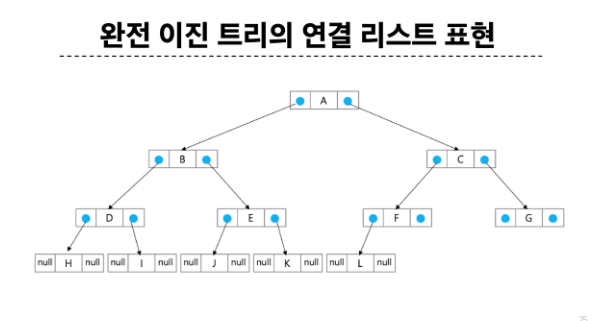

# 트리와 그래프

목차

1. 트리
- 트리 구조와 용어
- 이진 트리
- 이진 트리 순회

2. 그래프
- 그래프 유형과 표현

3. 참고
- BST
  - 개요
  - 주요연산 - 탐색
  - 주요연산 - 삽입
  - 주요연산 - 삭제

## 트리
### 트리 구조와 용어
#### 트리
- 비선형 구조
- 원소들 간에 1:N 관계를 가지는 자료구조
- 원소들 간에 계층관계를 가지는 계층형 자료구조
- 상위 원소에서 하위 원소로 내려가면서 확장되는 트리(나무)모양의 구조

#### 트리 정의
- 한 개 이상의 노드로 이루어진 유한 집합이며 다음 조건을 만족한다.
  - 노드 중 최상위 노드를 **루트**(root)라 한다. (노드(node)는 트리의 원소)
  - 나머지 노드들은 n(>=0)개의 분리 집합 T_1, ...T_N으로 분리될 수 있다.
- 이들 T_1, ...T_N은 각각 하나의 **트리**가 되며(재귀적 정의) 루트의 **부 트리**(subtree)라 한다.

#### 트리 용어
- 노드(node)
  - 트리의 원소
  - A, B, C, D, E, F, G, H, I, J, K

- 간선(edge)
  - 노드와 노드를 연결하는 선
  - 부모 노드와 자식 노드를 연결

- 루트 노드(root node)
  - 트리의 시작 노드인 최상위 노드
  - 트리 T의 루트 노드 - A

- 형제 노드(sibling node)
  - 같은 부모 노드의 자식 노드들
  - B, C, D는 형제 노드

- 조상 노드(ancestor node)
  - 간선을 따라 루트 노드까지 이르는 경로에 있는 모든 노드들
  - K의 조상 노드: F, B, A

- 서브 트리(subtree)
  - 부모 노드와 연결된 간선을 끊었을 때 생성되는 트리

- 자손 노드(descendant node)
  - 서브 트리에 있는 하위 레벨의 노드들
  - B의 자손 노드 - E, F, K

- 차수(degree)
  - 노드의 차수
    - 노드에 연결된 자식 노드 수
    - B의 차수 = 2, C의 차수 = 1
  - 트리 차수
    - 트리에 있는 노드의 차수 중에서 가장 큰 값
    - 트리 T의 차수 = 3
  - 단말 노드(leaft node)
    - 차수가 0인 노드 즉, 자식 노드가 없는 노드

- 레벨
  - 루트에서 노드까지의 거리
  - 루트 노드의 레벨은 0, 자식 노드의 레벨은 부모 레벨 + 1

- 높이
  - 루트 노드에서 가장 먼 리프 노드까지의 간선 수
  - 트리의 높이는 최대 레벨(트리 T의 높이 = 3)
  

### 이진 트리
#### 이진 트리(Binary Tree)
- 차수가 2인 트리
- 각 노드가 자식 노드를 최대한 2개까지만 가질 수 있는 트리(왼쪽 / 오른쪽 자식 노드)
- 모든 노드들이 최대 2개의 서브 티리를 갖는 특별한 형태의 트리

#### 이진 트리 특성
- 레벨 i에서의 노드의 최대 개수는 2개
- 높이가 h인 이진 트리가 가질 수 있는 노드의 최소 개수는 (h+1)개가 되며, 최대 개수는 (2^(h+1)-1)개가 된다.

#### 포화 이진 트리(Perfect Binary Tree)
- 모든 레벨에 노드가 포화 상태로 차 있는 이진 트리
- 높이가 h일 때, 최대 노드 개수인 (2^(h+1)-1)의 노드를 가진 이진 트리
  - 높이가 3일 때 2^(3+1)-1=15개의 노드
- 루트를 1번으로 하여 2^(h+1)-1까지 정해진 위치에 대한 노드 번호를 가짐

#### 편향 이진 트리(Skewed Binary Tree)
- 높이 h에 대한 최소 개수의 노드를 가지면서 한쪽 방향의 자식 노드만을 가진 이진 트리
  - 왼쪽 편향 이진 트리
  - 오른쪽 편향 이진 트리

#### 리스트를 이용한 이진 트리의 표현
- 리스트를 이용한 이진 트리의 표현
  - 이진 트리에 각 노드 번호를 다음과 같이 부여
  - 루트의 번호를 1로 함
  - 레벨 n에 있는 노드에 대하여 왼쪽부터 오른쪽으로 2^n부터 2^(n+1)-1까지 번호를 차례로 부여

#### 리스트를 이용한 이진 트리의 표현
- 리스트를 이용한 이진 트리의 표현
  - 이진 트리에 각 노드 번호를 다음과 같이 부여
  - 루트의 번호를 1로 함
  - 레벨 n에 있는 노드에 대하여 왼쪽부터 오른쪽으로 2^n부터 2^(n+1)-1까지 번호를 차례로 부여

  

- 노드 번호가 i일 때
  - 부모 노드 번호 : i / 2
  - 왼쪽 / 오른쪽 자식 노드 번호 : 2 * i, 2 * i + 1
  - 레벨 n의 노드 번호 시작 번호는? 2^n

  

  - 노드 번호를 리스트의 인덱스로 사용
  - 높이가 h인 이진 트리를 위한 배열의 크기
    - 레벨 i의 최대 노드 수는 ? 2^i
    - 따라서 모든 노드의 수는 ? 1+2+4+...+2^i = sum(2^i) = 2^(h+1)-1
    - 리스트의 크기는 ? 2^(h+1)

  
  

#### 리스트를 이용한 이진 트리 표현의 단점
- 편향 이진 트리의 경우에 사용하지 않는 리스트 원소에 대한 메모리 공간 낭비 발생
- 트리의 중간에 새로운 노드를 삽입하거나 기존의 노드를 삭제할 경우 리스트의 크기 변경이 어려워 비효율적

#### 연결 리스트를 이용한 이진 트리 표현
- 리스트를 이용한 이진 트리의 표현의 단점을 보완하기 위해 연결 리스트를 이용하여 트리를 표현할 수 있다.
- 이진 트리의 모든 노드는 최대 2개의 자식 노드를 가지므로 일정한 구조의 이중 연결 리스트 노드를 사용하여 구현

#### 완전 이진 트리의 연결 리스트 표현

### 이진 트리 순회
#### 이진 트리 순회(traversal)
- 순회(traversal): 트리의 노드들을 체계적으로 방문하는 것
- 3가지의 기본적인 순회 방법
  - 전위순회(preorder traversal) : VLR
    - 부모 노드 방문 후, 자식 노드를 좌/우 순서로 방문한다.
  - 중위순회(inorder traversal) : LVR
    - 왼쪽 자식 노드, 부모 노드, 오른쪽 자식 노드 순으로 방문한다.
  - 후위순회(postorder traversal) : LRV
    - 자식 노드를 좌우 순서로 방문한 후, 부모 노드를 방문한다.

#### 전위 순회
- 수행방법
  1) 현재 노드 T를 방문하여 처리한다. -> V
  2) 현재 노드 T의 왼쪽 서브 트리로 이동한다. -> L
  3) 현재 노드 T의 오른쪽 서브 트리로 이동한다. -> R
- 수행순서
  1) A -> T1 -> T2
  2) A -> B(T3)E -> C F G
  3) A B D H I E C F G

#### 중위 순회
- 수행방법
  1) 현재 노드 T의 왼쪽 서브 트리로 이동한다. -> L
  2) 현재 노드 T를 방문하여 처리한다. -> V
  3) 현재 노드 T의 오른쪽 서브 트리로 이동한다. -> R
- 수행순서
  1) T1 -> A -> T2
  2) B(T3)E -> A -> C F G
  3) H D I B E A F C G

#### 중위 순회
- 수행방법
  1) 현재 노드 T의 왼쪽 서브 트리로 이동한다. -> L
  2) 현재 노드 T의 오른쪽 서브 트리로 이동한다. -> R
  3) 현재 노드 T를 방문하여 처리한다. -> V
- 수행순서
  1) T1 -> T2 -> A
  2) (T3) E B -> F G C -> A
  3) H I D E B F G C A

#### 수식 트리(Expression Tree)
- 수식을 표현하는 이진 트리
- 수식 이진 트리(Expression binary Tree)라고 부르기도 함
- 연산자는 루트 노드이거나 가지 노드
- 피연산자는 모두 앞 노드

#### 수식 트리의 순회
- 전위 순회
  - + * * / A B C D E
- 중위 순회
  - A / B * C * D + E
- 후위 순회
  - A B / C * D * E +

## 그래프
### 그래프 유형과 표현
#### 그래프
- 아이템(사물 또는 추상적인 개념)들과 이들 사이의 연결 관계를 표현한다.
- 정점(Vertex) : 그래프의 구성요소로 하나의 연결점
- 간선(Edge) : 두 정점을 연결하는 선
- 차수(Degree) : 정점에 연결된 간선의 수
- 그래프는 정점(Vertex)들의 집합과 이들을 연결하는 간선(Edge)들의 집합으로 구성된 자료 구조
  - V : 정점의 개수, E : 그래프에 포함된 간선의 개수
  - V 개의 정점을 가지는 그래프는 최대 V * (V-1) / 2 간선이 가능
  - 예) 5개 정점이 있는 그래프의 최대 간선 수는 (5 * 4 / 2) 10개
- 선형 자료구조나 트리 자료구조로 표현하기 어려운 N : M 관계를 가지는 원소들을 표현하기에 용이하다.

#### 그래프 유형
- 무방향 그래프(Undirected Graph)
- 방향 그래프(Directed Graph)
  - 진출 차수 / 진입 차수 [라이브 다시 보기]
- 가중치 그래프(Weighted Graph)
- 사이클 없는 방향 그래프(DAG, Directed Acyclic Graph)
- 트리(Tree)
- 완전 그래프
  - 정점들에 대해 가능한 모든 간선들을 가진 그래프
- 부분 그래프
  - 원래 그래프에서 일부의 정점이나 간선을 제외한 그래프
- 트리도 그래프이다.
  - 각 노드는 최대 하나의 부모 노드가 존재할 수 있다.
  - 각 노드는 자식 노드가 없거나 하나 이상이 존재할 수 있다.
  - 두 노드 사이에는 유일한 경로가 존재한다.

#### 인접 정점
- 인접(Adjacency)
  - 두 개의 정점에 간선이 존재하면 서로 인접해 있다고 한다.
    - 두 개의 간선으로 이어진 정점은 서로 인접 X
  - 완전 그래프에 속한 임의의 두 정점들은 서로 인접해 있다.
  - 두 정점 1과 2는 서로 인접해 있다.

  

#### 그래프 경로
- 경로(Path)란 어떤 정점 A에서 시작하여 다른 정점 B로 끝나는 순회로 두 정점 사이를 잇는 간선들을 순서대로 나열한 것
  - 같은 정점을 거치지 않는 간선들의 sequence
  - 어떤 정점에서 다른 정점으로 가는 경로는 여러 가지일 수 있다.
  - 0 - 6의 경로 예시
    - 정점들 : 0 - 2 - 4 - 6
    - 간선들 : (0, 2), (2, 4), (4, 6)
  
  

#### 싸이클(Cycle)
- 경로의 시작 정점과 끝 정점이 같음
- 시작한 정점에서 끝나는 경로
- 1 - 3 - 5 - 1

  

#### 그래프 표현
- 간선의 정보를 저장하는 방식, 메모리나 성능을 고려해서 결정
- 인접 행렬(Adjacent matrix)
  - V * V 크기의 2차원 배열을 이용해서 간선 정보를 저장
- 인접 리스트(Adjacent List)
  - 각 정점마다 다른 정점으로 나가는 간선의 정보를 저장
- 간선 리스트(Edge List)
  - 간선(시작 정점, 끝 정점)의 정보를 객체로 표현하여 리스트에 저장

#### 인접 행렬
- 두 정점을 연결하는 간선의 유무를 행렬로 표현
  - V * V 정방 행렬 (행의 수와 열의 수가 같은 행렬)
  - 행 번호와 열 번호는 그래프의 정점에 대응
  - 두 정점이 인접되어 있으면 1, 그렇지 않으면 0으로 표현
- 무향 그래프
  - i번째 행의 합 = i번째 열의 합 = V_i의 차수
- 유향 그래프
  - 행 i의 합 = V_i의 진출 차수
  - 열 i의 합 = V_i의 진입 차수

   

#### 인접 행렬 정리
- 장점
  - 두 정점 사이에 간선이 있는지 확인하는 연산이 O(1)로 빠름
  - 구현이 단순
  - **정적 그래프**에 적합 (정적 그래프 : 정점과 간선의 개수가 변하지 않음)
- 단점
  - 많은 메모리를 차지함(공간 복잡도: O(V^2))
  - 간선 수를 확인하거나 인접한 정점을 나열하는 연산이 느림
- 사용하기 좋은 상황
  - Dense Graph(밀집그래프)에 적합
  - 두 정점 사이에 간선이 있는지 빠르게 확인해야 하는 경우

#### 인접 리스트
- 각 정점에 대한 인접 정점들을 순차적으로 표현
- 하나의 정점에 대한 인접 정점들을 각각 노드로 하는 연결 리스트로 저장

#### 인접 리스트 정리
- 장점
  - 필요한 공간만 사용하므로 공간 복잡도 O(V + E)
  - 인접한 정점을 나열하는 연산이 빠름
- 단점
  - 두 정점 사이에 간선이 있는지 확인하는 연산이 느림 (O(V))
  - 링크드리스트로 구현이 복잡
- 사용하기 좋은 상황
  - Sparse Graph(최소 그래프)에 적합
  - 그래프가 동적으로 변하는 경우(정점과 간선이 자주 추가/삭제)
  - 인접한 정점을 자주 순회해야 하는 경우

#### 간선 리스트
- 두 정점에 대한 간선 그 자체를 객체로 표현하여 리스트로 저장
- 간선을 표현하는 두 정점의 정보를 나타냄(시작 정점, 끝 정점)

#### 간선 리스트 정리
- 장점
  - 필요한 간선만 저장하므로 공간 복잡도 O(E)
  - 간선을 직접 다루는 연산에 효율적
- 단점
  - 두 정점 사이에 간선이 있는지 확인하는 연산이 느림 (O(E))
  - 특정 정점에 인접한 정점을 ㅊ찾는 연산이 느림 (O(E))
- 사용하기 좋은 상황
  - 간선 중심 연산을 자주 수행해야 하는 경우(예: MST)