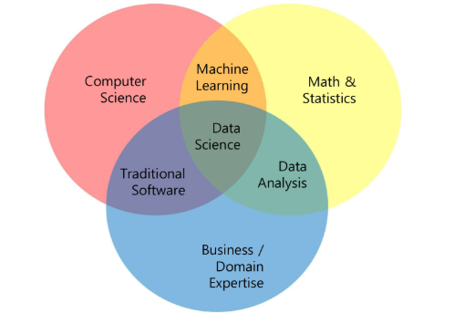
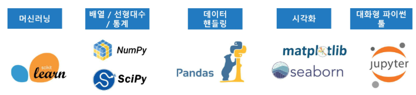
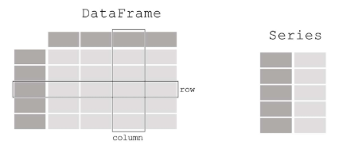
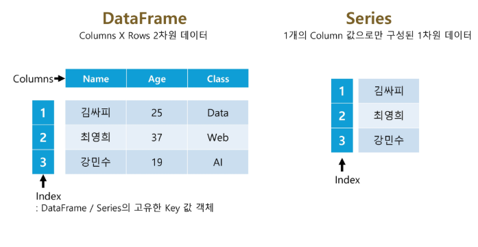
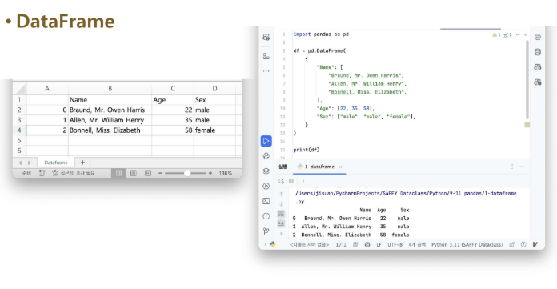
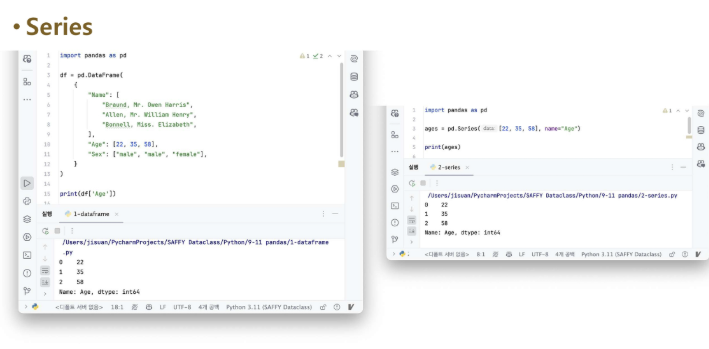
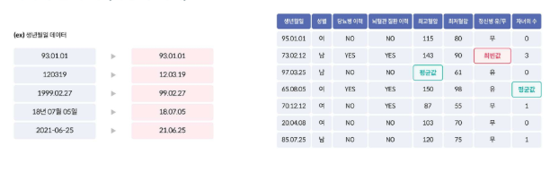
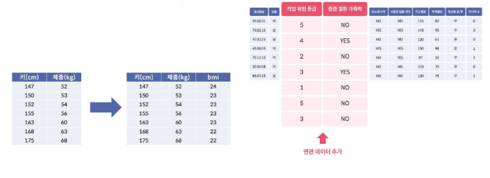

# 데이터 기초 - Pandas 기초
<details>
<summary>INDEX</summary>

1. 데이터 분석 개론
2. Pandas의 개념 및 활용
3. 데이터 프레임 생성 및 조작
4. 데이터 정제 및 전처리
5. 데이터 인덱싱과 필터링

</details>
---

## 1. 데이터 분석 개론
### 1) 데이터 분석의 중요성 및 역할
#### 데이터 분석은 왜 하나요?
- 카페를 차리고 싶은데 어느 지역에 차려야 할까?
  - > 대학가에 열면 장사가 더 잘 될까? → 대학별 거주인구와 지역별 카페의 폐업률 분석
- 온라인 쇼핑몰에서 상품을 판매하고 싶은데 어떤 상품이 잘 팔릴까?
- 새로운 음식 배달 서비스를 시작하고 싶은데 어느 시간대에 집중할까?
- 회사의 신규 채용 전략을 세우고 싶은데 어떤 부서에 인력이 필요한가?
- 어떤 마케팅 캠페인을 실행할지 결정하고 싶은데 어떤 전략이 효과적일까?
- 제조업체에서 불량률을 낮추고 싶은데 어떤 공정에서 문제가 생길까?

- > <span style='font-size:20px;'>합리적인 의사 결정을 위해</span>
- > <span style='color:red'>갖고 있는 자원에서 최적의 선택</span>
---

### 2) 데이터 분석 프로세스의 이해
#### 데이터 분석은 어떻게 하나요?
- 가설을 설정하고 데이터 만들기 (인터뷰, 리서치, 데이터 설계 후 수집)
- 쌓인 데이터에서 필요한 데이터를 선별 및 조회 (쿼리 조회, 데이터 가공, 인프라 구축)
- 데이터 기반 가설 검증 (통계 분석, 수학적 모델링)
- 결과 공유 (데이터 시각화, PPT 작성, PT)

#### 데이터 분석의 절차
1. Step 1 - 문제 정의
    - 신규 공동주택 단지에 초등돌봄센터의 규모가 얼마나 되어야 할까?
    - 도서지역의 헬기를 통한 응급환자 이송 중단율이 너무 높아! 대책이 필요해!
    - 노인 치매환자들에 대한 지자체 차원의 선제적 관리가 필요해! 효율적으로 할 수 없을까?

2. Step 2 - 데이터 기획
    - 전입·전출 현황, 동별인구 현황, 초·중학교수, 연령대별 인구, 인근 병원 수, ...
    - 섬별·월별 헬기이송 건수, 섬별 이송 거리·이동 시간, 건강검진 및 진료내역, ...
    - 생활권별 노인인구, 가구별 라이프스타일·소득수준, 지역 돌봄시설, 병원방문 빈도, ...

3. Step 3 - 데이터 수집
4. Step 4 - 데이터 전처리
5. Step 5 - 데이터 시각화
6. Step 6 - 분석 및 인사이트 도출
---

### 3) 데이터 분석의 역할
#### 데이터 분석은 무슨 일인가요?
- 서비스들의 현황을 수치로 표현하고 인사이트 도출
- 어느 서비스가 더 좋은지 가설 검증을 위한 A/B 테스트 진행
- 고객에 대한 데이터에서 의미 있는 결과를 뽑아내기 위해 보고서 작성
- 현업의 사례 : 마케팅 분석 / 고객 인사이트 / 비즈니스 성과

#### 구체적인 분석의 업무 사례는?
- 비즈니스 성과 : 어떤 가격이 가장 매출을 높일 수 있는 가격일까?
  - 알라미 : Pricing 실험, 연구독 vs. 월구독 어떤 걸 더 많이 팔아야 효과적일까?
  - 쏘카 : 10시간 이상 빌리는 경우 요금 10% 이상 인하 실험, 차량 가동률 2배 상승
- 마케팅 : 지난주 유입은 왜 떨어졌을까? 쿠폰을 몇 퍼센트를 제공해야 할까?
  - 마켓컬리 : CRM(고객 관계 관리) 쿠폰 실험
- 고객 인사이트 : 고객은 왜 이탈할까?

#### 좀 더 구체적인 분석의 업무 사례는?
- 업무 : 코로나 시절 쏘카 대여존 모니터링, 대여존 별 증차량 / 감차량을 결정하는 업무
- 현상 : 한양대존에 쏘카존 이용시간 감소 포착 But 매출은 오히려 증가
  - 매출이 증가했으니 차량 수를 늘려야할까?
  - 왜 매출은 급격하게 오른걸까?
  - 

- 과거 분석 결과 : 연령별로 시간 당 매출이 많이 차이가 난다는 것을 알게 됨
- 한양대존의 매출을 연령별로 나누어 본 결과 : 20대 감소, 30대 이상 증가
  - 비대면 수업으로 20대 감소
  - 30대 이상은 왜 매출이 증가했을까?
  - 

- 운영팀에서 한양대존의 증가한 30대 수요는 한양대존 근처 뚝섬지역에서 발생했을 것이라고 추측
- 예약 위치를 살펴보니, 뚝섬 근처 업무 지구였으며, 뚝섬의 쏘카존은 차량이 매우 부족한 상태임을 확인함
- 뚝섬의 차량이 부족하게 되자, 한양대까지 와서 쏘카를 빌리는 것이었음.
  - 결론 : 증차가 필요한 곳은 뚝섬이고, 한양대존의 차량도 뚝섬으로 옮겨야 함.
- 
---

### 4) 데이터 관련 직무
#### 데이터 관련 직무
- 데이터 분석가
  - 통계적 분석, 시각화, 인사이트 도출
- 데이터 사이언티스트
  - 수학적 모델, 머신러닝, 인공지능
- 데이터 엔지니어
  - 수집, 정제, 저장(?) (파이프라인)
- ML/DL 엔지니어
  - LLM + 모델 운영, 성능
- PM
- etc ...

#### 데이터 계열 직무의 필요 역량


---
### 5) 파이썬 머신러닝 생태계
#### 파이썬 머신러닝 생태계


---

## 2. Pandas의 개념 및 활용
### 1) Pandas Overvie
#### Pandas란?
- 관계형(relational) 혹은 레이블(labeling)된 데이터를 효율적으로 다루기 위해 설계된 Python 기반의 데이터 분석 라이브러리
  - 빠르고 유연하며 표현력이 풍부한 데이터 구조를 제공
  - 다양한 데이터 분석 작업을 손쉽게 처리할 수 있도록 고수준의 빌딩 블록(high-level building blocks) 제공
  - 오픈 소스 라이브러리이기 때문에 누구나 자유롭게 사용
  - NumPy를 기반으로 개발되었기 때문에, 과학 계산 및 머신러닝 라이브러리들과의 호환성과 통합성을 갖춤
- Pandas에서 다룰 수 있는 데이터의 타입
  - SQL table, Excel spreadsheet 같이 유형이 다른 열들을 포함할 수 있는 표 형식의 데이터 (Tabular data)
  - 순서가 있거나 (Ordered) 없는 (Unordered) 데이터
  - 시계열 (Time series) 데이터
  - 행 및 열이 있는 임의의 행렬 데이터 (행렬의 각 구성요소가 다른 유형의 데이터들도 가능)
  - 다른 유형의 관찰 / 통계 데이터셋 (명시적인 레이블이 없어도 유연하게 처리 가능)

#### Pandas에서 제공하는 Data structure
- 1차원을 다루는 Series
  - 한 줄짜리 데이터 목록으로 모든 값이 같은 타입
- 2차원을 다루는 DataFrame
  - 각 열(column)의 데이터 타입이 다를 수 있으며 크기를 자유롭게 조절할 수 있는 형태
  - 

#### Pandas의 장점
- 결측치 처리 용이 : NaN으로 결측값 표현, dropna, fillna 등 제공
- 행/열 추가·삭제 간편 : append, drop 등으로 손쉽게 조작
- 정렬 기능 : 자동 또는 sort_values, sort_index로 명시적 정렬 가능
- GroupBy 제공 : SQL처럼 그룹 단위 집계 가능
- 다양한 객체 변환 : 리스트, 딕셔너리, NumPy 등에서 DataFrame 생성 가능
- Merge/Join 지원 : merge, join, concat 등으로 데이터 결합
- 파일 입출력 지원 : CSV, Excel, DB,JSON 등 다양한 포맷 읽기 / 쓰기 가능

### 2) Pandas의 주요 구성 요소
#### DataFrame, Series, Index




---

## 3. 데이터 프레임 생성 및 조작
### 1) Pandas의 주요 메서드
#### Pandas의 주요 메서드
- `read_csv()` : CSV 파일을 데이터프레임으로 불러옴
- `head()` : 데이터프레임의 상위 몇 개 행을 출력
- `shape` : 데이터프레임의 행과 열 개수를 출력
- `info()` : 데이터프레임의 컬럼, 데이터 타입, 결측치 정보를 출력
- `describe()` : 수치형 데이터의 요약 통계를 제공
- `value_counts()` : 특정 컬럼의 값 개수를 세어 출력
- `sort_values()` : 특정 컬럼 기준으로 정렬
  
---

## 4. 데이터 정제 및 전처리
### 1) 데이터 정제 및 전처리 이론
#### 데이터의 처리
- 데이터 수집이 완료되면 데이터를 모델에 넣기 전에 알맞게 가공하는 과정
- 분석 결과의 질을 높이기 위해 데이터를 변형하는 과정
- 어떤 전처리를 적용하느냐에 따라 원본 데이터가 다르게 변형되므로, 결과도 달라질 수 있음

#### 데이터의 처리 방법
- 데이터의 형식 맞추기
- 빈 칸 채우기
- 데이터 열 추가 (연관 데이터 추가)
- 데이터 열 추가 (이상치 제거)




| 이상치 종류 | 예시 | 해결방법 |
|:-----------:|:----:|:--------:|
| 존재할 수 없는 값 | - 성별 변수(1, 2로만 나타낸)에 3<br>- MZ세대 데이터에 생년월일 변수에 1960-03-05 | 논리적으로 존재할 수 없으므로, 바로 결측 처리 후 분석 시 제외 |
| 극단적인 값 | - 키 변수에 250m <br> - 혼자 평균값보다 10배이상 큰 구매액 | 정상범위 기준을 정한 후, 이를 벗어나면 결측처리(정상범위 기준을 정하는 방법에는 정규분포를 이용하기, boxplot을 이용하기, 결정트리를 이용하기 등 여러가지가 있음) |

#### missing 데이터 처리
- `isna()` : 데이터프레임 또는 배열에서 결측값(NaN)이 있는지 여부를 True/False로 반환
- `fillna()` : 결측값(NaN)을 지정한 값으로 대체(채움)
- `dropna()` : 결측값(NaN)이 포함된 행 또는 열을 제거

```python
df1 = df.reindex(index = dates[0:4], columns = list(df.columns) + ['E'])
df1.loc[dates[0] : dates[1], 'E'] = 1
df1
# drops any rows that have missing data:
df1.dropna(how='any')
# fills missing data
df1.fillna(value=5)
```

#### 빈칸 채우기
- missing 데이터 확인
- `pd.isna(df1)`

---

## 5. 데이터 인덱싱과 필터링
### 1) DataFrame 인덱싱 및 필터링
#### DataFrame 인덱싱 및 필터링
1. []
   - 컬럼 단일 선택 : `df['col1']` -> Series 반환
   - 컬럼 여러 개 선택 : `df[['col1', 'col2']]` -> DataFrame 반환
   - Boolean Indexing과 함께 사용 가능 : `df[df['col1'] > 10]` -> 조건에 맞는 행 필터링

2. `loc[]`/`iloc[]`
    - loc : 행/열 이름으로 접근
    - iloc : 정수 위치 기반 인덱싱 (숫자 인덱스 사용)

3. `Boolean Indexing`
    - 조건식에 따른 필터링

#### [] 컬럼 기반 필터링 또는 불린 인덱싱 필터링
- 단일 컬럼명 입력 시 컬럼명에 해당하는 Series 객체 반환
- 여러 개의 컬럼명들을 list로 입력 시 컬럼명들에 해당하는 DataFrame 객체 반환
- p.58

#### loc[] / iloc[]
- 명칭(Label) 기반 인덱싱 `loc[]`
  - 컬렴(열)을 추출하는 경우 : '컬럼명' 같이 이름(label)으로 열 지정
  - 행을 추출하는 경우 : 행의 인덱스 이름(label)을 사용해 지정
  - 행과 열을 함께 지정하는 경우 -> `df.loc[행이름, 열이름]` 형식 사용
- 위치(Position) 기반 인덱싱 `iloc[]`
  - 레이블(이름)이 아닌 정수 위치로 데이터 지정
  - 가로축(행), 세로축(열)의 좌표를 기반으로 행과 열 추출
  - 행, 열의 위치값을 정수로 입력하여 선택(0부터 시작)
    - 예 : `df.iloc[0, 1]` -> 첫 번째 행, 두 번째 열
  
#### Boolean Indexing
- 조건식을 [] 안에 기입하여 간편하게 필터링 수행
  - 나이가 60 이상인 데이터 필터링
    - `titanic_boolean = titanic_df[titanic_df['Age'] >= 60]`