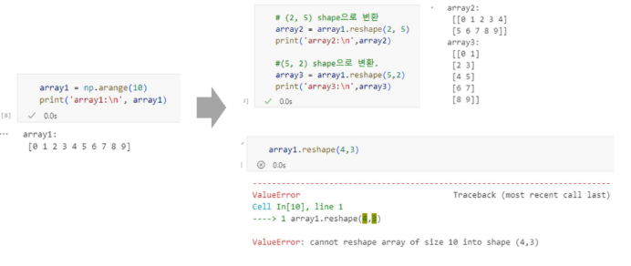
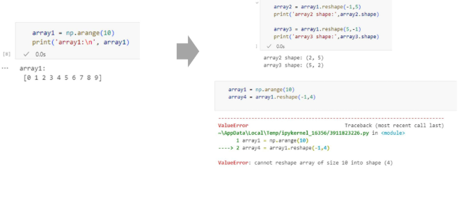
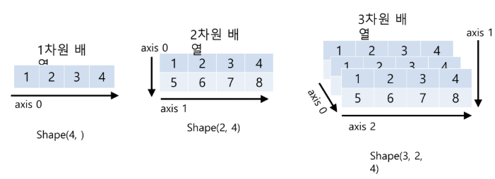

# 데이터 기초 - Pandas 심화
<details>
<summary>INDEX</summary>

1. Pandas와 Numpy
2. 데이터 처리와 집계
3. 데이터 병합 및 변환

</details>

## 1. Pandas와 Numpy
### 1) Pandas와 Numpy
#### Pandas는 주로 2차원 데이터(표 형태, DataFrame)를 다룰 떼 유용
- 데이터 분석, 전처리, 조작이 편리함
- 엑셀, CSV, SQL 결과 같은 표 형식의 데이터 처리에 최적화되어 있음

#### NumPy는 다차원 배열(1D, 2D, 3D 이상)을 다루는 데 특화됨
- 특히 딥러닝과 고성능 연산을 위해 주로 사용됨
- 3차원 이상 데이터(이미지, 시계열, 텐서 연산 등) 처리에 적합함

### 2) NumPy의 ndarray
#### ndarray : N 차원(Dimension) 배열(Array) 객체
- 1차원 배열
  |   |   |   |   |
  |---|---|---|---|
  | 1 | 2 | 3 | 4 |

- 2차원 배열
  |   |   |   |   |
  |---|---|---|---|
  | 1 | 2 | 3 | 4 |
  | 5 | 6 | 7 | 8 |

- 3차원 배열
  |   |   |   |   |
  |---|---|---|---|
  | 1 | 2 | 3 | 4 |
  | 5 | 6 | 7 | 8 |
  
  |   |   |   |   |
  |---|---|---|---|
  | 1 | 2 | 3 | 4 |
  | 5 | 6 | 7 | 8 |

  |   |   |   |   |
  |---|---|---|---|
  | 1 | 2 | 3 | 4 |
  | 5 | 6 | 7 | 8 |

#### ndarray 생성 : `array()`
- 인자로 주로 파이썬 list 또는 ndarray 입력
  ```python
  import numpy as np

  # 1차원 배열 생성
  array1 = np.array([1, 2, 3])

  # 2차원 배열 생성
  array2 = np.array([[1, 2, 3], [4, 5, 6]])
  ```
  ```bash
  array1:
  [1, 2, 3]

  array2:
  [[1, 2, 3]
    [4, 5, 6]]

#### ndarray 생성 : `arange()`
- 0부터 9까지의 숫자를 순차적으로 생성
  ```python
  sequence_array = np.arange(10)
  print(sequence_array)
  print(sequence_array.dtype, sequence_array.shape)
  ```
  ```bash
  [0 1 2 3 4 5 6 7 8 9]
  int32 (10,)
  ```

#### ndarray 생성 : `zeros()` / `ones()`
- (3, 2) shape을 가지는 모든 원소가 0, dtype은 int32인 ndarray 생성
  ```python
  zero_array = np.zeros((3, 2), dtype = 'int32')
  print(zero_array)
  print(zero_array.dtype, zero_array.shape)
  ```
  ```bash
  [[0 0]
   [0 0]
   [0 0]]
  int32 (3, 2)
  ```

#### 데이터 타입 : `ndarray.dtype`
- ndarray 내 데이터 타입은 같은 데이터 타입만 가능 -> `ndarray.dtype` 속성
- 즉, 한 개의 ndarray 객체에 int와 float 함께 불가능 -> `astype()` 활용하여 형변환

```python
list1 = [1, 2, 3]
print(type(list1))
array1 = np.array(list1)
print(type(array1))
print(array1, array1.dtype)
```
```bash
<class 'list'>
<class 'numpy.ndarray'>
[1 2 3] int32
```

### 3) ndarray의 형태(shape)와 차원(ndim)
#### 형태 : `ndarray.shape` 속성 / 차원 : `ndarray.ndim` 속성

| array | 차원 | Shape |
|:-----:|:---:|:-----:|
| [1 2 3] | 1차원 | (3, ) |
| [[1 2 3],<br>[4, 5, 6]] | 2차원 | (2, 3) |
| [[[1 2 3],<br>[4 5 6]],<br>[[7 8 9],<br>[10 11 12]]] | 1차원 | (2, 2, 3) |

```python
# (2, 3) shape을 가지는 모든 원소가 1, dtype은 int32인 ndarray 생성.
array2 = np.array([[1, 2, 3],
                    [4, 5, 6]])
print('array2:')
print(array2)
print('Shape:', array2.shape)
print('차원 수 (ndim):' array2.ndim)
```
```bash
array2:
[[1 2 3]
 [4 5 6]]
Shape: (2, 3)
차원 수 (ndim): 2
```

#### `reshape()` : 차원과 크기를 변경


#### `reshape(-1, N)`: 차원과 크기를 변경
- -1에 해당하는 axis의 크기는 가변적
- -1이 아닌 인자 값에 해당하는 axis 크기는 인자 값으로 고정하여 shape 변환
  

### 4) ndarray의 axis(축)
#### `axis`
- 행, 열, 높이 단위 (X)
- `axis0`, `axis1`, `axis2`와 같이 axis 단위로 부여
  

### 5) Pandas에서 제공하는 Data Structure
#### 1차원에서 다루는 Series
- 한 줄짜리 데이터 목록으로 모든 값이 같은 타입

#### 2차원을 다루는 DataFrame
- 각 열(column)의 데이터 타입이 다를 수 있으며 크기를 자유롭게 조절할 수 있는 형태

### 6) DataFrame과 Numpy/List/딕셔너리 상호변환
#### Numpy/List/Dictionary -> DataFrame

| 변환 형태 | 코드 |
|:--------:|:---:|
| List -> DataFrame | `list2df = pd.DataFrame(list, columns = col_name)` |
| Numpy(ndarray) -> DataFrame | `np2df = pd.DataFrame(ndarray, columns = col_name)` |
| Dictionary -> DataFrame | `dict = {'col1': [1, 11], 'col2': [2, 22], 'col3': [3, 33]}` <br>`dict2df = pd.DataFrame(dict)` |

#### DataFrame -> Numpy/List/Dictionary 

| 변환 형태 | 코드 |
|:--------:|:---:|
| DataFrame -> List  | DataFrame 객체의 values 속성을 이용하여 먼저 ndarray로 변환 후 `tolist()`를 이용하여 list로 변환 |
| DataFrame -> Numpy(ndarray) | DataFrame 객체의 values 속성을 이용하여 ndarray로 변환 |
| DataFrame -> Dictionary | DataFrame 객체의 `to_dict()`를 이용하여 변환 |

## 2. 데이터 처리와 집계
### 1) 데이터 처리
#### 객체 생성
- Default index인 RangeIndex을 사용한 객체 생성
  ```python
  import numpy as np
  import pandas as pd

  s = pd.Series([1, 3, 5, np.nan, 6, 8])
  s
  ```
  ```bash
  0   1.0
  1   3.0
  2   5.0
  3   NaN
  4   6.0
  5   8.0
  dtype: float64
  ```

- `datetime index`를 사용한 객체 생성
- 딕셔너리를 사용한 객체 생성

#### 데이터 확인
- DataFrame을 numpy로 변환
- 통계정보 확인
- Transpose 연산
- DataFrame에서 Series 데이터 추출
- DataFrame에서 slice를 사용하여 행들을 추출(label slice)
- 특정 행과 열에 있는 scalar 값 추출

#### position을 활용한 데이터의 선택
#### boolean을 활용한 indexing


  [이번 수업 코드](../../2_pandas_advanced/pandas_advanced.ipynb)

### 2) 데이터 정렬
#### `sort_values()`
- 오른차순이 기본 `(ascending = True)`
- 내림차순 정렬 시 `ascending = False` 설정
    
#### `unique()`
- 컬럼 내 몇 건의 고유값이 있는지 파악

#### `sum()`/`max()`/`min()`/`count()`
- DataFrame, Series에서 집계(Aggregation) 수행

#### `groupby()`
- 데이터를 특정 컬럼을 기준으로 묶은 후, 해당 그룹에 대해 집계연산 수행
  - `groupby()` 수행 후 DataFrameGrouopBy 객체를 반환
  - 반환된 DataFrameGroupBy 객체에 대해 다양한 집계(Aggregation) 함수를 적용
- 동일한 컬럼에 대해 서로 다른 집계함수를 적용하고 싶은 경우 `agg()` 활용
- 여러 컬럼에 여러 집계함수 적용 시 `agg()` 내에 딕셔너리 형태로 전달


    [이번 수업 코드](../../2_pandas_advanced/pandas_advanced.ipynb)

### 3) 데이터 가공
#### lambda식 이해
- 일반 함수
  ```python
  def get_double(a):
      return a * 2
  
  print('3의 두배는:', get_double(3))
  ```

- lambda 식
  ```python
  lambda_double = lambda x : x * 2
  print('3의 두배는:', get_double(3))
  ```

#### `apply()`
- lambda식을 결합하여 데이터를 일괄적으로 가공
  - 'Name_len': 이름의 길이를 일괄 계산하여 추가
    ```python
    titanic_df['Name_len'] = titanic_df['Name'].applay(lambda x : len(x))
    titanic_df[['Name', 'Name_len']].head(3)
    ```
  
  - 'Child_Adult' : 나이가 15세 이하면 'Child', 그렇지 않은 경우 'Adult'
    ```python
    titanic_df['Child_Adult'] = titanic_df['Age'].applay(lambda x : 'Child' if x <= 15 else 'Adult')
    titanic_df[['Age', 'Child_Adult']].head(8)
    ```

    [이번 수업 코드](../../2_pandas_advanced/pandas_advanced.ipynb)


## 3. 데이터 병합 및 변환
### 1) 데이터 병합 및 변환
#### 데이터의 병합
- concat
  - 행 병합 : `axis=0`
  - 열 병합 : `axis=1`

- Inner Merge
  - `df_merged = pd.merge(df1, df2, on='key', how='inner')`

- Outer Merge
  - `df_merged = pd.merge(df1, df2, on='key', how='outer')`

- Left Merge
  - `df_merged = pd.merge(df1, df2, on='key', how='left')`

- Right Merge
  - `df_merged = pd.merge(df1, df2, on='key', how='right')`

- join
  - `df_merged = df1.join(df2, how='left')`

- 열 이름 변경
  - `df_merged = pd.merge(df1, df2, on='key', how='inner', suffixes = ('_left', '_right'))`

- 불필요한 열 제거
  - `df_merged = pd.merge(df1, df2, on='key', how='inner')`
  - `df_merged = df_merged.drop('B', axis=1)`

- 여러 열 기준 병합
  - `df_merged = pd.merge(df1, df2, on=['key1', 'key2'], how='inner')`

#### 데이터의 변환 : `replace()`
  - 원본 값을 특정 값으로 대체
  - 결측값 처리 시에도 사용

    [이번 수업 코드](../../2_pandas_advanced/pandas_advanced.ipynb)