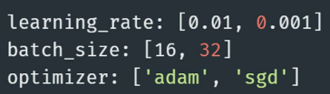

# 데이터사이언스 활용 - MLFlow 데이터 실험 환경 구축
<details>
<summary>목차</summary>

1. 머신러닝 실험 환경의 필요성

2. MLFlow Tracking을 활용한 실험 관리 전략

3. MLFlow를 활용한 모델 관리 및 배포

</details>

## 1. 머신러닝 실험 환경의 필요성
### 1) 머신러닝 실험
#### 머신러닝 실험이란?
- 모델의 성능을 개선하거나 다양한 설정을 비교 분석하기 위해 반복적으로 수행하는 <span style='color:blue'>과정 중심의 실험 활동</span>
- 즉, '어떤 데이터를 써서', '어떤 알고리즘에', '어떤 하이퍼파라미터를 적용했더니', '어떤 결과가 나왔는지' 체계적으로 비교하는 작업


#### 왜 실험이 중요한가?
- 머신러닝에서는 하나의 정답이 존재하지 않고, <span style='color:blue'>여러 조건에 따라 성능이 달라지기 때문에</span> 실험이 필수적

  - 데이터셋 : 전처리 방식에 따라 결과가 크게 달라질 수 있음
  - 모델 구조 : 동일한 데이터여도 모델 구조가 성능에 영향을 줌
  - 하이퍼파라미터 : 학습률, 에폭 수, 정규화 강도 등
  - 성능 지표 : Accuracy, F1 score, AUC 등 목적에 따라 다름

### 2) 반복 실험의 문제점
#### 실험이 반복되면 어떤 문제가 생길까?
- 엑셀에 기록하다 보면 어느 실험이 어떤 설정인지 기억하기 어려움
- 실수로 같은 실험을 중복 진행하거나, 더 좋은 모델을 잃어버림
- 여러 명이 협업할 때 '이 모델이 어디서 나온거지'라는 상황 발생

#### 예시 시나리오
  
  - > 정리를 안해두면 나중에 '왜 이게 성능이 좋았지' 기억이 안나는 상황 발생
  - > 그래서 필요한 것이 **실험 관리 도구**(MLFlow 등)

#### 재현성(Reproducibility)의 문제
- '이 모델이 왜 나왔는지, 다시 만들 수 있을까?'
  - 코드와 결과는 있지만, 어떤 하이퍼파라미터로 학습했는지 기억이 안 나는 경우
  - 데이터 전처리 방법이나 랜덤 시드가 기록되지 않은 경우
  - 실험 중간에 환경(python 패키지 버전 등)이 바뀌는 경우
  - > 다시 똑같은 성능을 재현할 수 없음
  - > 논문이나 리포트 제출 시 신뢰도 하락
  - > 실무에선 QA, 테스트에서 큰 문제 발생

#### 버전 관리의 문제
- '이 모델, 어떤 코드 버전에서 나온 거였지?'
  - 같은 train.py 파일인데 중간에 코드 바뀜
  - 파일명을 복사해서 train2.py, train_final_final2.py 식으로 쓰게 되는 상황
  - 데이터셋도 계속 갱신되지만 이력이 안 남음
  - > 실험 결과를 다시 해석하기 어려움
  - > 버그가 있는 코드에서 나온 모델이 어디에 쓰였는지 추적 불가능
  - > 조직 내에서 신뢰할 수 없는 모델로 인식

#### 협업의 문제
- '동료가 만든 모델, 어떻게 학습된 건지 모르겠어요'
  - 실험 결과 공유가 슬랙/구두/스크린샷에 의존
  - 모델은 공유되지만, 학습 파라미터, 평가 방식, 데이터가 없음
  - 실험명이 'best_model_v3.pkl'식으로 되어 있어 의미 없음
  - > 협업자 간에 커뮤니케이션 오류 발생
  - > 실험 중복, 불필요한 시간 낭비
  - > 실험 결과가 조직적으로 축적되지 않음

#### 비효율적인 반복 작업
- '똑같은 실험, 이미 했던 상황'
  - 기존 실험 기록이 없어 같은 실험을 다시 시도
  - 실험 로그는 있는데 엑셀/메모/폴더에 흩어져 있어 검색 불가
  - > 불필요한 리소스 낭비(시간, 전력, 인프라)
  - > 연구 생산성 저하

#### 성과 측청 및 비교의 어려움
- '결국 어떤 모델이 제일 좋았는지 알 수 없는 경우'
  - 다양한 모델은 실험했지만, 성능 비교 테이블이 없음
  - 지표 종류마다 따로 기록되어, 비교 자체가 어려움
  - > 정확한 모델 선택이 어려움
  - > 튜닝 결과가 장기적으로 축적되지 않음

### 3) 실험 추적 및 관리 도구
#### 실험 추적 도구의 필요성
- 반복 실험에서 발생하는 문제를 해결하기 위함
- 실험마다 사용된 코드, 데이터, 하이퍼파라미터, 성능 지표를 자동으로 기록
- 실험 결과를 비교 분석할 수 있는 인터페이스 필요

#### 실험 환경 자동화의 필요성
- 실험은 단순 로깅을 넘어서, 재현 가능한 환경에서 실행되어야 함

#### 실험 추적 + 모델 저장 + 서빙까지 지원하는 통합 도구 : MLFlow
- MLFlow는 오픈 소스로 제공되는 머신러닝 실험 관리 플랫폼
- 다양한 프레임워크와 호환성이 좋음
- 실험 로그 관리 뿐 아니라 모델 저장, 등록, 서빙까지 한번에 가능

## 2. MLFlow Tracking을 활용한 실험 관리 전략
### 1) 실험 관리 전략
#### 실험 관리 전략이란?
- 실험을 체계적으로 계획하고 수행하고 비교 분석하는 전 과정
- 실험 목표 수립 → 실험 단위 정의 → 비교 가능한 실험 설계 → 자동화
- 예시로 실험 목적에 따른 실험 공간을 분리해서 관리할 수 있음
  

### 2) 실험 결과 저장 위치 구조
#### MLFlow 실험 디렉토리 구조
- MLFlow는 실험 데이터를 기본적으로 mlruns/ 디렉토리에 저장
- 로컬 저장 기준이며, 백엔드 저장소를 바꾸면 DB/S3 등에 저장 가능
- 추가로 MLFlow UI에 접속하면 해당 Run을 클릭하면 파일 구조를 확인 가능
  
  - `Metrics/` : 실험 성능 지표 파일들
  - `Params/` : 하이퍼파라미터 저장
  - `Artifacts` : 모델, 이미지 등 결과물
  - `Meta.yaml` : 사용한 데이터 버전

### 3) 실험 단위 구분
#### 실험 단위 구분 전략 : 실험 그룹 / Run 이름 정리법
- 실험 그룹 : `baseline_rf_exp1`, `tuned_rf_exp2`
- Run 이름 : `max_depth=5`, `max_depth=10`
- 모델/데이터/전처리 조합에 따라 Run 그룹화
- 파일 이름 형식도 '모델명_전처리 방법_데이터셋 버전'으로 하면 명확함
  

### 4) 실험 정보 구조화
#### 실험 정보를 체계적으로 기록하는 방법
- MLFlow는 실험 정보를 4가지 요소로 구분해 기록
- 각각의 정보는 비교, 분석, 재현성에 중요한 역할을 가짐
- `Params` → 실험 조건, 실험 설정값(하이퍼파라미터) [Learning_rate=0.01, max_depth=5]
- `Metrics` → 성능 결과, 성능 지표 [Accuracy=0.89, auc=0.91]
- `Tags` → 설명 요약, 실험 설명, 날짜 등 메타 정보 [Exp_purpose=baseline_test, author=kim]
- `aetifact` → 결과물 저장소, 결과 파일, 시각화, 모델 등 [모델 파일, confusion_matrix.png, 로그]

### 5) 실험 태그 및 노트 관리 방법
#### MLFlow는 메타 정보 태그화
- UI와 API에서 태그 기반 검색이 가능함 → 실험 분류 / 필터링에 유용
- 아래 예시처럼 사용 가능
  | 태그 키 | 용도 |
  |:------:|:---:|
  | Author | 작성자 이름 |
  | Description | 실험 목적 |
  | Notes | 참고 사항 |
  | Data_version | 사용한 데이터 버전 |
  

### 6) 커스텀 로깅 전략
#### 중요한 정보를 직접 로깅하는 방법
- MLFlow는 기본 로깅 외에도 <span style='color:blue'>내가 원하는 정보를 자유롭게 추가 가능</span>
- 모델의 의미 있는 지표를 따로 로깅 가능(val_f1, recall 등)
- 태그에 설명을 담아 UI에서 실험의 목적, 주요 이벤트도 기록이 가능
  

### 7) 고급 실험 로깅
#### 자동화된 실험 반복 + 시각화 저장하는 방법
- GridSearch나 반복 실험에서 각 결과를 자동으로 MLFlow에 로깅하면 관리가 편함
- 실험별 파라미터, 지표 로깅, ROC curve, confusion matrix 이미지를 생성 후 저장
- 반복 실험이 많을수록 자동 로깅 코드 구조화는 필수
- 시각화 파일도 artifact로 저장하면 UI 상에서 바로 확인이 가능함
  

### 8) 실험 비교 전략
#### 실험 결과를 효율적으로 비교하는 방법
- MLFlow UI에서는 다양한 실험을 필터링, 정렬, 시각화하며 비교 가능
- 파라미터 조합별 성능 비교가 쉬워짐
- 성능이 아니라, 실험 설정 자체에 주목 가능
  | 실험 목적 | 분리할 Experiment 예시 |
  |:--------:|:--------------------:|
  | 필터링 | 특정 조건(max_depth=10)으로 run 선택 |
  | 지표 정렬 | Accuracy 등 성능 기준으로 정렬 |
  | 그래프 비교 | 여러 Run의 성능 변화 시각화(선형 그래프, 히트맵) |
  | 다운로드 | CSV로 성능 결과 저장 가능 |

### 9) 실험 검색 / 비교 예시
#### Python API를 활용한 실험 검색
- 기본 실험은 ID = 0 (Default experiment)
- 사용자 지정 실험 생성 시 ID 증가
  

### 10) 실험 실패 / 중단 상황 관리
#### Try...finally / try...expect + mlflow.end_run()
- 실험이 끝나면 mlflow.end_run() 명령어를 통해 명시적으로 종료해줘야 로그가 깔끔하게 남음
- 하지만 에러가 나면 종료가 누락될 수 있음
  
  - 실제 로그를 별도 저장
  
  -  실패한 Run 필터랑 후 복구 or 재실행

### 11) 실험 자동화 흐름 예시
#### Config.yaml에 실험 조건 정의
- 반복할 실험의 조건(예 : 하이퍼파라미터)을 YAML 파일에 정의해두면, 실험을 체계적으로 구성하고 재사용 가능
- 아래는 config.yaml 예시
  

#### itertools.product 또는 반복문으로 조합 생성
- 모든 실험 조합을 만들기 위해 Python의 itertools.product를 사용하거나 중첩 반복문을 사용할 수 있음
- 아래는 코드 예시
  

#### mlflow.start_run() 블록 안에서 파라미터와 결과를 자동으로 로깅
- 각 조합에 대해 하나의 실험(run)이 생성되며, 비교 / 시각화에 활용
  

### 12) 실험 관리 전략 팁
#### 실험을 전략적으로 관리
- MLFlow는 실험 전략 실행 플랫폼
- 실험 이름 / 구조 설계 → 자동화된 로깅 → 정리된 비교 → 재현성 확보
- 단순 로그 기록이 아니라, <span style='color:blue'>모델 실험을 반복 가능한 연구 활동</span>으로 만드는 도구

#### 실험 관리 시 유용한 팁 3가지
- 실험명 관리 : 실험 목적, 날짜 포함
- Jupyter 요약 정리 : mlflow.search_runs()로 테이블 생성
- 중단 대비 로깅 : try-finally로 중간 로그 남기기

### 13) MLFlow Tracking 구조 다시 보기
#### MLFlow Tracking의 구조
- MLFlow Tracking의 구조는 다음과 같은 계층적 구조
- Experiment : 실험의 상위 그룹 (예 : 'RandomForest 튜닝 실험')
- Run : 하나의 실험 실행 단위 (예 : 'max_depth=10, n_estimators=100')
  

#### Experiment 단위로 실험을 분류
- 실제 실험을 반복하다보면 다양한 실험 목적 발생
- 표와 같이 실험 단위마다 별도의 Experiment 객체를 만들어 실험을 논리적으로 그룹화 가능
  | 실험 목적 | 분리할 Experiment 예시 |
  |:--------:|:--------------------:|
  | 베이스라인 모델 성능 측정 | `Baseline_model_exp` |
  | 하이퍼파라미터 튜닝 | `RF_tunning_exp` |
  | 전처리 기법 적용 실험 | `smote_test_exp` |
  | 다른 모델 비교 실험 | `model_comparison_exp` |

#### 하나의 Experiment에는 여러 개의 Run이 존재
- 각 Run은 실험 한 번 실행 시 생성되는 단위
- 파라미터, 성능지표, 로그, 모델 등을 저장
- 예시 : `rf_tuning_exp` 안에 있는 Run
  - Run이 많아져도 같은 목적 안에서 모아서 비교할 수 있어 관리가 쉬움
    

#### Run ID 기반 추적
- MLFlow는 각 Run에 대해 고유한 Run ID를 부여
- 이 Run ID는 실험 결과의 정확한 출처를 추적하거나, 특정 모델을 재사용할 때 사용
- 저장된 모델과 실험 로그를 연결할 수 있어 <span style='color:blue'>재현성과 추적성 확보 </span>
- 예시 : 모델을 저장하고 나중에 불러올 때
  


### 14) MLFlow 하이퍼파라미터 튜닝
#### 하이퍼파라미터 튜닝의 중요성
- 하이퍼파라미터는 학습 알고리즘의 학습 방식에 직접적인 영향을 미침
- 잘 튜닝된 모델 vs. 기본값 모델 → 성능 차이가 상당함
- GridSearch, RandomSearch, HyperOpt 등의 사용
  

#### Grid Search vs. Random Search 개념 정리
- 하이퍼파라미터 튜닝의 대표적인 2가지 기법
  | 항목 | Grid Search | Random Search |
  |:---:|:-----------:|:-------------:|
  | 탐색 방식 | 지정된 모든 하이퍼파라미터 조합을 완전 탐색 | 임의의 조합 일부만 무작위 탐색 |
  | 계산 비용 | 조합 수가 많을수록 기하급수적으로 증가 | 조합 수를 지정 가능 |
  | 사용 시기 | 조합 수가 적거나, 중요한 파라미터가 명확할 때 적합 | 조합 수가 많거나, 중요한 파라미터를 미리 알기 어려울 때 적합 |
  | 장점 | 최적 조합을 놓치지 않음<br>간단하고 직관적 | 빠르고 효율적<br>높은 차원의 탐색 공간에서 유리함 |
  | 단점 | 비효율적 | 최적값을 정확히 찾지 못할 가능성 있음 |

#### Hyperopt란?
- 머신러닝 모델의 하이퍼파라미터 튜닝을 자동으로 수행해주는 라이브러리
- 핵심 목표는 최적의 파라미터 조합을 효율적으로 찾는 것

#### Hyperopt 특징
- `목적 기반 최적화` : 단순 반복이 아닌, 성능을 기반으로 검색
- `이전 결과 학습` : 과거 실험 결과를 기반으로, 다음 탐색 위치를 정교하게 조정
- `계산량 절약` : 수백 개 실험을 거치지 않아도 좋은 조합에 빠르게 수렴
- `다양한 공간 지원` : 실수형, 정수형, 범주형, 조건부 파라미터 등 복잡한 탐색 구조 지원

### 15) MLFlow 모델 관리 및 배포
#### 실험 결과로 나온 모델
- ML 실험의 목적은 결국 좋은 모델을 찾는 것
- 성능 좋은 모델을 저장, 버전 관리, 배포할 수 있어야 실무에 사용 가능
- MLFlow는 이 과정을 <span style='color:blue'>Tracking(실험기록)과 연결된 모델 저장 시스템(Model Registry)</span>으로 처리
  

#### Stage란?
- MLFlow Model Resgistry에서 하나의 모델 버전이 어떤 배포 단계에 있는지를 표시하는 상태 값
- MLFlow에서 모델은 다음과 같은 'stage' 상태를 가질 수 있음

#### 상태
- 모델 개발 및 실험 → None
- 성능 검증 후 테스트 환경 배포 → Staging
- QA 통과 후 서비스 배포 → Production
- 새 모델로 교체되면 이전 모델 → Archived
  | 상태 | 설명 |
  |:---:|:----:|
  | None | 초기 등록 |
  | Staging | 테스트 또는 검증 단계 |
  | Production | 실제 서비스에 배포된 모델 |
  | Archived | 더 이상 사용하지 않는 이전 버전 모델 |

#### 모델 버전 관리
- MLFlow에서는 하나의 모델 이름 아래 여러 버전의 모델을 등록할 수 있음
- 최근에는 Alias 방식이 도입되면서, 자유로운 문자열로 여러 버전으로 저장 가능
  

#### 새로운 방식 : Alias
- 어떤 alias를 동일 버전에 연결할 수 있고, 하나의 alias를 쉽게 다른 버전으로 전환 가능
- 버전 관리 + 배포 환경 + 실험 그룹을 명확하게 구분이 가능
  
  

### 16) MLFLow models 구조 소개
#### MLFlow 구성요소 및 개념
- 모델 포맷(Flavor) : 다양한 프레임워크 지원(sklearn, keras, xgboost 등)
- 모델 경로 : run ID 기반으로 저장
- 환경 정보 : conda.yaml, Mlmodel, requirement.txt 자동 생성
  

#### 모델 저장의 필요성
- Pickle, joblib : 간단하지만 환경 정보 없음, 코드 추적 불가
- MLFlow Models : 모델뿐 아니라 실험 환경, 입력 형태, 프레임 워크 정보까지 저장 가능
- 핵심은 실험 결과를 재현하고 협업하려면 단순한 `.pkl` 파일로는 부족

### 17) MLFlow 모델 저장 방법
#### 모델 저장 방법
- `log_model()`은 모델 객체와 함께 실행 환경 정보까지 함께 저장
- UI에서도 해당 모델 확인 가능
- 모델을 저장하면서 자동으로 artifact에 등록
  
  

#### 저장된 모델 불러오기
- 모델 검증 시, 추론 테스트를 위해 저장된 모델 불러오기
- 모델 서빙 시, API배포에 활용
- `mlflow.pyfunc.load_model()`을 사용하면 공통 인터페이스로 불러올 수 있음
  

#### 모델 저장 위치 설정(로컬 vs 원격)
- 로컬 디스크 : 기본 설정, 간단한 실험에 적합
- S3, GCS : 팀 프로젝트, 클라우드 기반 실험에 적합
- 데이터베이스(e.g. SQLite, MySQL) : 실험 메타데이터 저장 용도로도 활용 가능

#### 모델 저장 위치 설정 코드


### 18) 모델 관리 및 배포
#### 모델 경량화 및 구조 분석 팁
- 저장된 mlmodel 파일에는 모델 flavor, 입력/출력 signature 정보가 있음
- signature를 정의하면 추론 시 입력 형태를 자동 검증 가능
  ```python
  from mlflow.models.signature import infer_signature
  signature = infer_signature(X_train, y_pred)
  mlflow.sklearn.log_model(model, 'model', signature = signature)
  ```

#### 모델 관리 배포의 흐름
- 모델 저장 → 로딩 → 예측
- 실험이 끝난 후, 성능이 좋은 모델 선택 → 모델 저장(`log_model`) → Run ID 기반으로 불러와서 예측 수행 → 예측 결과를 평가하고 다시 로깅

### 19) 모델 배포 전략
#### 로컬 환경에서 API로 서빙하기
- MLFlow 서빙 명령어를 통해 배포 가능
- `mlflow models serve -m runs:/<run_id>/model -p 5000`

#### 기본 구성
- RESTful API 형식
- `/invocations` 엔드포인트로 JSON 데이터로 POST
  ```json
  curl -X POST http://localhost:5000/invocations \
    -H "Content-Type: application/json" \
    -d '{"columns":["feat1", "feat2"], "data":[[1, 2]]}'
  ```

### 20) MLFlow 모델 서빙
#### MLFlow 모델 서빙
- MLFlow 서빙은 훈련된 머신러닝 모델을 운영 환경에 쉽게 배포할 수 있도록 도와주는 도구
  

#### MLFlow 모데 서빙 엔진
- MLFlow로 모델을 서빙할 때 선택할 수 있는 엔진
  | 항목 | FastAPI(기본) | MLServer(고급/확장형) |
  |:---:|:-------------:|:-------------------:|
  | 용도 | 로컬 테스트, 일반 서비스용 | 고성능, 대규모 서비스용 |
  | 설치 | MLFlow 설치 시 기본 포함 | 추가 설치 필요 |
  | 서빙 프레임워크 | FastAPI(ASGI 기반, 빠름) | ML Server (Seldon/Kserve와 연동) |
  | 성능 | 비동기 처리 지원, 빠름 | 병렬 추론, 일괄 처리, 효율 극대화 |
  | 확장성 | 단일 서버 중심(수평 확장 어려움) | Kubemetes 네이티브 확장 가능(오토스케일링)|
  | 추론 API | `/Invacations` 엔드 포인트 사용 | 동일한 `/Invocations` 사용 |

### 21) MLFlow 모델 서빙 환경 및 확장성
#### 서빙 환경 고려사항
- 입출력 형식 : Signature 미지정 시 예측 요청 에러 발생 가능 → 입력 스키마 명확히 지정 필요
- 동시 요청 처리 : 기본 서버는 단일 스레드 → 실무 배포 시 gunicom, uvicorn 등 활용 권장 
- Docker 서빙 : MLflow models build-docker 명령으로 모델을 컨테이너화해 이식성 향상

#### MLFlow Models의 확장성
- `다양한 프레임워크 지원` : scikit-learn, tensorflow, xgboost, pytorch 등과 연동 가능
- `이식성` : Databricks, AWS SageMaker 등 다양한 플랫폼에 배포 가능
- `모델 관리 연계` : 추후 Model Registry, 서빙 인프라 (API Gateway 등)와 자연스럽게 연결됨
- `통합 구조` : 모델 저장 → 로딩 → 배포까지 하나의 포맷으로 처리 가능 (MLmodel + artifact)

## 3. MLFlow Tracking을 활용한 모델 관리 및 배포
### 1) 실행 비교, 모델 선택, REST API 배포 실습
#### 목표
- 하이퍼파라미터 스윕 실행
- MLFlow UI에서 실행 결과를 비교
- 가장 좋은 Run을 선택하여 모델 등록
- REST API에 모델 배포

#### 실험 내용
- 데이터셋 : 와인 품질 데이터셋
- Keras 딥러닝 모델의 RMSE를 최소화
- > learning_rate와 momentum를 여러 값으로 수정
- 각각의 실험 결과를 MLflow에 자동으로 기록

#### 실험 포인트
- 하이퍼파라미터 변경 후 비교
- 성능 비교와 모델 비교
- REST API 모델 배포
  

  

### 2) Wine 데이터 전처리


